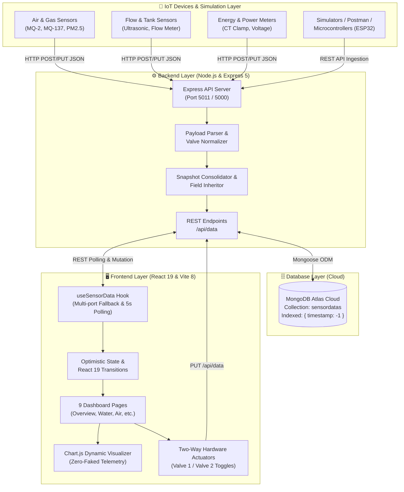

# 🏢 Sustainable Facility Intelligence (PS04) — Comprehensive Project Documentation

> **BPUT Hackathon 2026 — Problem Statement 04 (PS04)**  
> **Platform Name:** Sustainable Facility Intelligence (Facility AI)  
> **Architecture:** Modern Decoupled IoT Full-Stack (React 19 + Express 5 + MongoDB Atlas)

---

## 📑 Table of Contents

1. [Executive Summary](#1-executive-summary)
2. [End-to-End System Architecture](#2-end-to-end-system-architecture)
3. [Technology Stack Matrix](#3-technology-stack-matrix)
4. [Backend Deep Dive](#4-backend-deep-dive)
   - [Runtime & Web Framework](#runtime--web-framework)
   - [Database & Mongoose Telemetry Schema](#database--mongoose-telemetry-schema)
   - [API Routing & Ingestion Logic](#api-routing--ingestion-logic)
   - [Smart Merging & Field Inheritance](#smart-merging--field-inheritance)
   - [Valve Normalization & Hardware Actuation](#valve-normalization--hardware-actuation)
5. [Frontend Deep Dive](#5-frontend-deep-dive)
   - [Framework & Modern Tooling](#framework--modern-tooling)
   - [Design System & Styling Architecture](#design-system--styling-architecture)
   - [Telemetry Hook & State Management (`useSensorData`)](#telemetry-hook--state-management-usesensordata)
   - [Chart Engine & Data Helpers](#chart-engine--data-helpers)
   - [Application Modules & Pages](#application-modules--pages)
6. [Hardware & IoT Sensor Mapping](#6-hardware--iot-sensor-mapping)
7. [Project Directory Structure](#7-project-directory-structure)
8. [Setup, Installation & Execution Guide](#8-setup-installation--execution-guide)
9. [API Testing & Integration Reference](#9-api-testing--integration-reference)

---

## 1. Executive Summary

**Sustainable Facility Intelligence** is a real-time, centralized IoT environmental telemetry and facility automation platform designed for modern campus and industrial infrastructures. It ingests, analyzes, and visualizes multi-sensor metrics spanning **9 critical operational domains**:

1. **Air Quality & Atmospheric Chemistry:** AQI, PM2.5, PM10, CO₂, Smoke (MQ-2), Ammonia (MQ-137), and TVOC (MiCS-6814).
2. **Weather & Microclimate:** Rainfall precipitation, anemometer wind speeds, bearing direction, and solar light intensity (lux).
3. **Smart Energy Grid:** Live wattage draw, daily cumulative kilowatt-hours, peak demand tracking, and tariff cost calculations.
4. **Hydraulic Automation & Leak Detection:** Water reservoir levels, daily consumption, ultrasonic/flow-meter rates, automated leak alerts, and bi-directional solenoid valve controls (`Valve 1` & `Valve 2`).
5. **Smart Waste Logistics:** Ultrasonic fill-level monitoring, total bins inventory, daily mass hauled, and predictive overflow warnings.
6. **Traffic & Parking Dynamics:** Optical/inductive loop occupancy ratios, occupied slots counters, daily vehicle turnover, and gate waiting latencies.
7. **Asset Health & Predictive Maintenance:** Operational machinery monitoring, facility utilization indexing, and preventive servicing counters.
8. **Campus Safety & Incident Management:** Safety scoring index, security dispatch trackers, active incident management, and emergency response latencies.
9. **AI Predictive Analytics & Rule Engines:** Neural energy load forecasts, hydraulic demand projection, atmospheric hazard alerts, and automated actuation recommendations.

---

## 2. End-to-End System Architecture

The project employs a decoupled client-server architecture with high resilience against network drops and partial sensor packets.



---

## 3. Technology Stack Matrix

### 🖥️ Frontend Technologies

| Technology / Library | Version | Role / Purpose |
| :--- | :--- | :--- |
| **React** | `^19.2.8` | Core UI library for reactive component trees, optimistic state, and concurrent transitions. |
| **React DOM** | `^19.2.8` | Renderer for React into the web browser DOM. |
| **Vite** | `^8.3.0` | Ultra-fast next-generation frontend bundler, HMR server, and asset optimizer. |
| **@vitejs/plugin-react** | `^6.1.1` | Vite plugin leveraging the lightning-fast Oxlint/Oxc compiler pipeline. |
| **Vanilla CSS3** | Custom | Custom CSS token system (`index.css`) with zero third-party utility bloat (no Tailwind), supporting CSS custom variables, gradients, and micro-interactions. |
| **Chart.js** | `^4.5.1` | HTML5 Canvas-based chart rendering for high-performance line curves, stacked bars, and ring doughnuts. |
| **React Icons** | `^5.7.0` | Material Design icon set (`react-icons/md`) providing iconography across dashboards and KPIs. |
| **@fontsource/inter** | `^5.3.0` | Self-hosted Google Inter typeface for consistent rendering across platforms. |
| **Oxlint** | `^1.81.0` | High-performance Rust-based linter for static code analysis. |

### ⚙️ Backend Technologies

| Technology / Library | Version | Role / Purpose |
| :--- | :--- | :--- |
| **Node.js** | `v18+ / v20+` | Asynchronous, event-driven JavaScript server runtime environment. |
| **Express.js** | `^5.2.1` | Next-generation lightweight web framework handling REST routing, middleware, and request processing. |
| **Mongoose** | `^9.10.1` | Object Data Modeling (ODM) library for MongoDB, providing strong schema definitions, validations, and query building. |
| **MongoDB Atlas** | Cloud v7+ | Managed NoSQL cloud database cluster hosting the `PS04` telemetry collection. |
| **CORS** | `^2.8.6` | Middleware enabling Cross-Origin Resource Sharing between frontend dev servers and backend ports. |
| **dotenv** | `^18.0.1` | Module that loads environment variables from `.env` into `process.env`. |
| **Nodemon** | `^3.1.14` | Development utility automatically restarting the Node server on file changes. |

---

## 4. Backend Deep Dive

The backend lives in the `backend/` directory and exposes a clean, fault-tolerant REST API.

### Runtime & Web Framework
- **Entrypoint:** [backend/server.js](file:///c:/Users/jyoti/Desktop/BPUT%20Hackathon%202026/PS04/backend/server.js)
- **Port:** Configured via `PORT` in `.env` (default: `5011` / `5000`).
- **Body Parsing & Resilient Decoders:**
  ```javascript
  app.use(cors());
  app.use(express.json());
  app.use(express.urlencoded({ extended: true }));
  app.use(express.text({ type: ['text/*', 'application/*'] }));
  ```
  The server features a custom middleware hook that intercepts raw strings or text-encoded JSON payloads from IoT microcontrollers and automatically converts them to valid JSON objects.

### Database & Mongoose Telemetry Schema
- **Model File:** [backend/models/SensorData.js](file:///c:/Users/jyoti/Desktop/BPUT%20Hackathon%202026/PS04/backend/models/SensorData.js)
- **Collection Name:** `sensordatas`
- **Indexing:** Automatic descending compound index on `{ timestamp: -1 }` for sub-millisecond retrieval of the latest telemetry snapshots.

#### Schema Fields Grouping:
1. **Facility Core:** `sustainabilityScore` (0–100), `timestamp` (Date), `source` (`'sensor' | 'manual' | 'synthetic'`), `location`, `notes`.
2. **Air Quality:** `aqi`, `pm25` (µg/m³), `pm10` (µg/m³), `co2` (ppm), `smoke` (ppm), `nh3` (ppm), `voc` (ppm).
3. **Weather:** `rainfall` (mm), `windSpeed` (km/h), `windDirection` (String), `lightIntensity` (lux).
4. **Energy:** `livePower` (kW), `todaysEnergy` (kWh), `peakDemand` (kW), `estimatedCost` (₹).
5. **Water & Valves:** `tankLevel` (%), `todaysUsage` (L), `flowRate` (L/min), `leakStatus` (`"Normal" | "Leak Detected"`), `valve1` (Boolean), `valve2` (Boolean).
6. **Waste:** `totalBins`, `averageFill` (%), `wasteCollected` (kg), `overflowRisk` (Count).
7. **Traffic & Parking:** `parkingOccupancy` (%), `occupiedSlots`, `totalSlots`, `vehiclesToday`, `avgWaitingTime` (min).
8. **Assets:** `totalEquipment`, `activeEquipment`, `utilization` (%), `maintenanceDue`.
9. **Safety:** `safetyScore` (0–100), `incidentsToday`, `openIncidents`, `avgResponse` (min).
10. **AI Forecasting:** `energyForecast` (kWh), `waterForecast` (L), `overflowPrediction` (hours).

### API Routing & Ingestion Logic
- **Route File:** [backend/routes/data.js](file:///c:/Users/jyoti/Desktop/BPUT%20Hackathon%202026/PS04/backend/routes/data.js)

| Route | Method | Description |
| :--- | :--- | :--- |
| `/api/data` | `GET` | Returns the latest consolidated snapshot. If different sensors post at different intervals, non-null values are smartly merged chronologically from the last 20 records. |
| `/api/data?all=true` | `GET` | Returns all records sorted newest-first. Supports `&limit=N` for historical charts. |
| `/api/data/:id` | `GET` | Fetches a single document by MongoDB `ObjectId`. |
| `/api/data` | `POST` | Ingests a new sensor reading. Automatically inherits unprovided fields from the previous snapshot so partial packets do not wipe out existing parameters. |
| `/api/data` | `PUT` | Updates the active live snapshot directly or creates one if the collection is empty. |
| `/api/data/:id` | `PUT` | Updates a specific snapshot record by ID. |
| `/api/data/:id` | `DELETE`| Deletes a specific snapshot record by ID. |
| `/api/data` | `DELETE`| Purges all records. Supports `?seedOnly=true` to delete only synthetic demo data. |

### Smart Merging & Field Inheritance
When an IoT node (e.g., an ESP32 monitoring only water) posts `{ "tankLevel": 82 }`, the backend inherits existing metrics (such as current `aqi` or `livePower`) from the previous database document. This prevents fragmented updates from blanking out the rest of the campus dashboard.

### Valve Normalization & Hardware Actuation
To bridge microcontrollers and web clients that transmit differing boolean casings (`true`, `"true"`, `1`, `Valve1`, or `valve1`), the backend applies `normalizeValveFields`:
```javascript
function normalizeValveFields(body) {
  if (body.Valve1 !== undefined) {
    if (body.valve1 === undefined) body.valve1 = body.Valve1;
    delete body.Valve1;
  }
  if (body.valve1 !== undefined) {
    body.valve1 = body.valve1 === true || body.valve1 === 'true' || body.valve1 === 1 || body.valve1 === '1';
  }
  // Identical logic applied for Valve 2
}
```

---

## 5. Frontend Deep Dive

The frontend lives in the `frontend/` directory and is built using React 19 and Vite 8.

### Framework & Modern Tooling
- **Build Engine:** Vite 8 ensures instant startup and sub-50ms Hot Module Replacement (HMR).
- **JSX Compiler:** Powered by the Rust-based Oxc parser via `@vitejs/plugin-react`.
- **Zero Third-Party Component Frameworks:** Clean, maintainable UI built with native DOM elements, custom CSS, and zero vendor lock-in.

### Design System & Styling Architecture
- **Stylesheet:** [frontend/src/index.css](file:///c:/Users/jyoti/Desktop/BPUT%20Hackathon%202026/PS04/frontend/src/index.css)
- **Aesthetic Principles:**
  - **Color Palette:** Curated modern slate theme (`#0f172a`), clean card surfaces (`#ffffff`), border tokens (`rgba(226, 232, 240, 0.85)`), and semantic accents (`--primary: #2563eb`, `--green: #10b981`, `--orange: #f59e0b`, `--red: #ef4444`, `--purple: #8b5cf6`).
  - **Sidebar:** Dark gradient (`#111c36` to `#0a1122`) with illuminated active indicators.
  - **Cards & Micro-Interactions:** Subtle elevation (`box-shadow`), smooth cubic-bezier transitions on hover, rounded borders (`18px`), and interactive states.
  - **Live Heartbeat Status:** Pulsing green/orange indicator in the header synced with real-time clock and network connectivity.

### Telemetry Hook & State Management (`useSensorData`)
- **Location:** [frontend/src/hooks/useSensorData.js](file:///c:/Users/jyoti/Desktop/BPUT%20Hackathon%202026/PS04/frontend/src/hooks/useSensorData.js)
- **Features:**
  1. **Multi-Port Failover Mechanism:** Automatically loops through candidate endpoints (`VITE_API_URL`, `http://localhost:5011/api/data`, `http://localhost:5000/api/data`, `/api/data`) to guarantee connection even if the backend port changes.
  2. **Configurable Polling:** Periodically updates data every 5 seconds (configurable via `VITE_POLL_INTERVAL`).
  3. **History Buffering:** Concurrently retrieves `?all=true&limit=20` and passes chronological records to the visualization engine.
  4. **Optimistic Updates:** Exposes `updateData(payload)` allowing UI components to instantly reflect user input (such as valve switches) while syncing to the database asynchronously.

### Chart Engine & Data Helpers
- **Component:** [frontend/src/components/ChartBox.jsx](file:///c:/Users/jyoti/Desktop/BPUT%20Hackathon%202026/PS04/frontend/src/components/ChartBox.jsx)
- **Helpers:** [frontend/src/utils/chartHelpers.js](file:///c:/Users/jyoti/Desktop/BPUT%20Hackathon%202026/PS04/frontend/src/utils/chartHelpers.js)
- **Zero Faked Multipliers:** Unlike typical mock templates, the chart helper maps purely from real historical array timestamps and numbers returned by the API. If no records exist, it renders a clean, non-disruptive empty indicator (`-`).
- **Chart Varieties:**
  - Smooth Bézier Line Charts (Energy draw, Water usage trends, Traffic flow, Air quality metrics).
  - Comparative Bar Charts (Hourly energy consumption, Facility safety metrics).
  - Doughnut Distributions (Energy sectoral split, Gas breakdown, Parking bay allocation, Smart bin fill status).

### Application Modules & Pages

The application is structured into 9 dedicated pages managed via [frontend/src/App.jsx](file:///c:/Users/jyoti/Desktop/BPUT%20Hackathon%202026/PS04/frontend/src/App.jsx):

```
frontend/src/pages/
├── Overview.jsx       # Facility KPI scorecard, zone status, and combined time-series
├── AirQuality.jsx     # Full gas telemetry, AQI rating, and microclimate indicators
├── Energy.jsx         # Live wattage, daily kWh, peak demand, and sectoral split
├── Water.jsx          # Reservoir level, flow rate, leak alarm, and Valve 1 & 2 toggles
├── Waste.jsx          # Smart bin capacity, ultrasound fill %, overflow alerts
├── Traffic.jsx        # Parking lot occupancy, occupied slots, turnover & gate wait time
├── Assets.jsx         # Machinery status, facility utilization %, maintenance queues
├── Safety.jsx         # Campus safety index, incident dispatch, emergency response
└── AIInsights.jsx     # AI neural forecast, demand projections & action triggers
```

#### Highlight: Hardware Actuator in `Water.jsx`
[frontend/src/pages/Water.jsx](file:///c:/Users/jyoti/Desktop/BPUT%20Hackathon%202026/PS04/frontend/src/pages/Water.jsx) includes a bi-directional physical actuator interface for **Main Inlet Valve 1** and **Emergency Release Valve 2**. Users can toggle the switches in real-time; the state is optimistically reflected with React 19 transitions and dispatched via `PUT /api/data` to trigger hardware relays on physical IoT controllers.

---

## 6. Hardware & IoT Sensor Mapping

For physical deployment and hardware demonstrations, the schema maps directly to common industry-standard sensors:

| Metric / Parameter | Compatible Hardware Sensor | Protocol / Signal | Unit |
| :--- | :--- | :--- | :--- |
| **AQI / PM2.5 / PM10** | Nova Fitness SDS011 / Plantower PMS5003 | UART / Digital | µg/m³ |
| **CO₂** | Winsen MH-Z19B NDIR Sensor | UART / PWM | ppm |
| **Smoke & Flammable Gas** | MQ-2 Semiconductor Gas Sensor | Analog (ADC) | ppm |
| **Ammonia (NH₃)** | MQ-137 Gas Sensor | Analog (ADC) | ppm |
| **VOC (Volatile Organics)**| MiCS-6814 / SGP30 Multi-Channel Gas | I2C / Analog | ppm |
| **Rainfall** | Tipping Bucket / Rain Drop Sensor | Digital Pulse / ADC | mm |
| **Wind Speed** | 3-Cup Anemometer (Pulse / Voltage) | Interrupt / ADC | km/h |
| **Light Intensity** | BH1750 / LDR Photoresistor | I2C / ADC | lux |
| **Power & Energy** | SCT-013 Split-Core CT Clamp + PZEM-004T | UART / Modbus | kW, kWh |
| **Water Level** | JSN-SR04T Waterproof Ultrasonic Sensor | GPIO Trigger/Echo | % |
| **Water Flow Rate** | YF-S201 Hall Effect Flow Meter | Digital Pulse (Hz) | L/min |
| **Valve Actuation** | 12V DC Solenoid Valve + 2-Channel Relay | GPIO High/Low | ON/OFF |
| **Smart Bin Fill** | HC-SR04 Ultrasonic Sensor | GPIO Trigger/Echo | % |
| **Parking Occupancy** | IR Obstacle / Ultrasonic Sensor Array | GPIO Digital | Occupied / Free |

---

## 7. Project Directory Structure

```
BPUT-Hackathon-2026-PS04/
├── API_DOCUMENTATION.md             # Complete REST API reference and payload guide
├── ProjectDocumentation.md          # Comprehensive full-stack architectural documentation
├── README.md                        # Quickstart repository readme
│
├── backend/                         # Express & Mongoose Backend Service
│   ├── models/
│   │   └── SensorData.js            # Consolidated Mongoose Telemetry Schema
│   ├── routes/
│   │   └── data.js                  # REST API Endpoints with field inheritance & normalization
│   ├── .env                         # Server environment variables (PORT, MONGODB_URI)
│   ├── .gitignore
│   ├── package.json                 # Backend dependencies (Express 5, Mongoose 9, CORS)
│   ├── package-lock.json
│   └── server.js                    # Server bootstrap, error handlers, and DB connection
│
└── frontend/                        # React 19 & Vite 8 Web Application
    ├── public/                      # Static web assets
    ├── src/
    │   ├── assets/                  # Icons and media
    │   ├── components/
    │   │   └── ChartBox.jsx         # Resilient Chart.js canvas wrapper
    │   ├── data/
    │   │   └── constants.js         # Navigation items and page titles
    │   ├── hooks/
    │   │   └── useSensorData.js     # Live polling hook with multi-port failover
    │   ├── pages/                   # 9 Multi-domain telemetry dashboards
    │   │   ├── AIInsights.jsx
    │   │   ├── AirQuality.jsx
    │   │   ├── Assets.jsx
    │   │   ├── Energy.jsx
    │   │   ├── Overview.jsx
    │   │   ├── Safety.jsx
    │   │   ├── Traffic.jsx
    │   │   ├── Waste.jsx
    │   │   └── Water.jsx
    │   ├── utils/
    │   │   └── chartHelpers.js      # Dynamic Chart.js dataset generators
    │   ├── App.jsx                  # Main application shell, sidebar & status bar
    │   ├── index.css                # Premium Vanilla CSS design system
    │   └── main.jsx                 # React root mount
    ├── .env                         # Frontend environment variables (VITE_API_URL, etc.)
    ├── .oxlintrc.json               # Oxlint configuration
    ├── index.html                   # HTML5 template
    ├── package.json                 # Frontend dependencies (React 19, Chart.js, Vite 8)
    ├── package-lock.json
    └── vite.config.js               # Vite bundler configuration
```

---

## 8. Setup, Installation & Execution Guide

### Prerequisites
- **Node.js** (v18.0.0 or higher recommended)
- **npm** (v9.0.0 or higher)
- **MongoDB Atlas Connection String** (already pre-configured in `backend/.env`)

---

### Step 1: Start the Backend Server

1. Open a terminal and navigate to the `backend` directory:
   ```bash
   cd backend
   ```
2. Install dependencies:
   ```bash
   npm install
   ```
3. Start the server:
   - For production / standard mode:
     ```bash
     npm start
     ```
   - For development with auto-reload (Nodemon):
     ```bash
     npm run dev
     ```
4. Verify the backend output:
   ```
   ✅  MongoDB connected
   🚀  Server running on http://localhost:5011
   ```

---

### Step 2: Start the Frontend Application

1. Open a second terminal window and navigate to the `frontend` directory:
   ```bash
   cd frontend
   ```
2. Install dependencies:
   ```bash
   npm install
   ```
3. Start the Vite development server:
   ```bash
   npm run dev
   ```
4. Open your browser and navigate to the displayed local URL (typically `http://localhost:5173`).

---

## 9. API Testing & Integration Reference

You can push simulated or live sensor data to the platform using `curl`, Postman, or microcontroller HTTP client requests.

### Example 1: Ingesting Live Telemetry (POST)

```bash
curl -X POST http://localhost:5011/api/data \
  -H "Content-Type: application/json" \
  -d '{
    "sustainabilityScore": 88,
    "aqi": 42,
    "pm25": 14,
    "co2": 415,
    "livePower": 45.2,
    "todaysEnergy": 178,
    "tankLevel": 78,
    "flowRate": 16.5,
    "leakStatus": "Normal",
    "valve1": true,
    "valve2": false,
    "averageFill": 38,
    "parkingOccupancy": 64,
    "occupiedSlots": 128,
    "totalSlots": 200,
    "safetyScore": 96
  }'
```

### Example 2: Actuating a Physical Valve (PUT)

```bash
curl -X PUT http://localhost:5011/api/data \
  -H "Content-Type: application/json" \
  -d '{
    "valve1": false,
    "valve2": true
  }'
```

### Example 3: Fetching the Current Consolidated Snapshot (GET)

```bash
curl -X GET http://localhost:5011/api/data
```

### Example 4: Fetching Chronological History for Charts (GET)

```bash
curl -X GET "http://localhost:5011/api/data?all=true&limit=20"
```

---

*Authored for the BPUT Hackathon 2026 — Problem Statement 04 Evaluation Team.*
