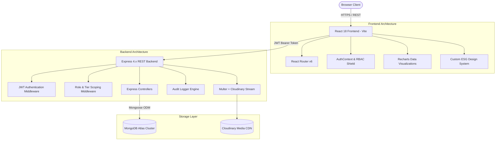
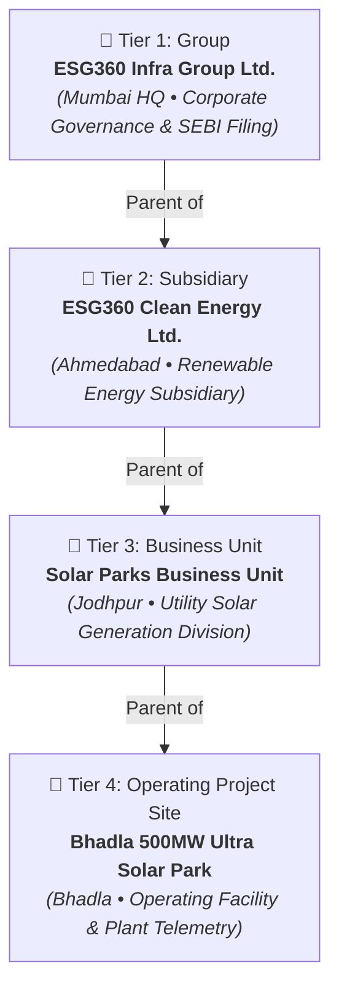

# ESG360 — Comprehensive System Architecture & User Guide
**Problem Statement 08 | BPUT Hackathon 2026**  
*Enterprise ESG Data Capture, Multi-Tier Consolidation & SEBI BRSR Compliance Platform*

---

## 📑 Table of Contents
1. [Executive Summary & Project Overview](#1-executive-summary--project-overview)
2. [End-to-End System Architecture](#2-end-to-end-system-architecture)
   - [Frontend Architecture](#frontend-architecture)
   - [Backend Architecture](#backend-architecture)
   - [Database & Storage Architecture](#database--storage-architecture)
   - [Security & Access Control (RBAC)](#security--access-control-rbac)
3. [4-Tier Organization Hierarchy](#3-4-tier-organization-hierarchy)
4. [Application Modules & Navigation Guide (Tabs Walkthrough)](#4-application-modules--navigation-guide-tabs-walkthrough)
   - [Landing Page](#41-landing-page-)
   - [Authentication & Access](#42-authentication--access-login)
   - [Dashboard](#43-dashboard-dashboard)
   - [Organizations Management](#44-organizations-organizations)
   - [Data Collection & ESG Modules](#45-data-collection--esg-modules-data-collection)
   - [SEBI BRSR Reporting](#46-sebi-brsr-reporting-brsr)
   - [Validation & Review Queue](#47-validation--review-queue-validation)
   - [Document & Evidence Vault](#48-document--evidence-vault-documents)
   - [Approvals Workbench](#49-approvals-workbench-approvals)
   - [Executive Analytics & Consolidation](#410-executive-analytics--consolidation-analytics)
   - [Notification Center](#411-notification-center)
   - [Compliance Audit Trail](#412-compliance-audit-trail-audit-logs)
5. [Recent Features, Enhancements & Bug Fixes](#5-recent-features-enhancements--bug-fixes)
6. [Demo Access Credentials & Role Matrix](#6-demo-access-credentials--role-matrix)
7. [API Endpoint Directory](#7-api-endpoint-directory)
8. [Setup, Execution & Deployment Guide](#8-setup-execution--deployment-guide)

---

## 1. Executive Summary & Project Overview

**ESG360** is a full-stack, enterprise-grade ESG (Environmental, Social, and Governance) compliance platform tailored specifically for complex infrastructure conglomerates. Designed and built to address **Problem Statement 08 of BPUT Hackathon 2026**, the system resolves the major challenges organizations face when collecting non-financial operational data from remote operating sites, validating compliance evidence, and filing statutory **SEBI BRSR (Business Responsibility and Sustainability Reporting)** disclosures.

### Core Problem It Solves
- **Fragmented Data Silos**: Replaces error-prone manual spreadsheets with structured digital telemetry and data entry at the facility level.
- **Traceability & Auditability**: Enforces a strict 6-stage verification workflow (Draft ➔ Submitted ➔ Under Review ➔ Validated ➔ Approved ➔ Correction Required) backed by timestamped immutable audit logs and Cloudinary evidence attachments.
- **Mathematical Multi-Tier Rollup**: Automatically aggregates operational metrics (Scope 1/2/3 carbon emissions, energy consumption, water intensity, workforce diversity, and OHS incident metrics) upward through operating sites, business units, subsidiaries, and group headquarters without data loss.
- **SEBI BRSR Core Mapping**: Pre-configured with disclosures covering Section A (General), Section B (Management & Process), and Section C (Principles 1 through 9).

---

## 2. End-to-End System Architecture



### Frontend Architecture
- **Framework**: React 18 with modern functional components and hooks (`useState`, `useEffect`, `useContext`, `useSearchParams`, `useNavigate`).
- **Build Tool**: Vite v8 providing sub-second HMR and production chunk minification (`npm run build` completes in < 3s).
- **Styling Architecture**: Pure, highly-tailored Vanilla CSS tokens (`global.css`, `layout.css`, `components.css`) utilizing modern design aesthetics (glassmorphism, subtle micro-animations, semantic status palettes, dark modes, and full-width fluid layouts).
- **State Management**: Context API (`AuthContext`) handling token persistence in `localStorage`, dynamic user profile hydration, permission checks, and reactive session timeouts.
- **Visualization Suite**: Recharts (`PieChart`, `BarChart`, `ResponsiveContainer`, custom tooltip formatters).
- **Icons**: Lucide React iconography.

### Backend Architecture
- **Runtime & Web Framework**: Node.js v24 + Express 4.x.
- **API Paradigm**: Standardized RESTful JSON conventions returning consistent response payloads:
  ```json
  {
    "success": true,
    "message": "Human readable summary",
    "data": { ... },
    "pagination": { "total": 100, "page": 1, "limit": 20, "pages": 5 }
  }
  ```
- **Error Handling**: Centralized error middleware catching Mongoose validation errors, duplicate keys (`code: 11000`), and JWT expiration.
- **Audit Interceptor**: Automated forensic logger (`auditLogger.js`) capturing user IP, user-agent, action, entity, organization, before/after metadata, and operation status.

### Database & Storage Architecture
- **Primary Database**: MongoDB Atlas with Mongoose ODM v8.
- **Indexes**: Compound indices configured for high-performance querying on `{ organization: 1, category: 1, status: 1 }` and `{ 'reportingPeriod.year': 1, 'reportingPeriod.quarter': 1 }`.
- **Blob / Document Storage**: Cloudinary Media API integrated via Node streamifier, streaming binary compliance evidence directly from memory buffers without temporary disk writes.

### Security & Access Control (RBAC)
- **Authentication**: Stateless HMAC-SHA256 signed JSON Web Tokens (JWT) with 7-day expiration.
- **Password Hashing**: Salted bcrypt hashing (10 salt rounds).
- **Hierarchical Data Scoping**:
  - `Super Admin` & `Group ESG Admin`: Unrestricted cross-organization read/write visibility.
  - `Subsidiary Admin`, `Business Unit Manager`, `Project User`: Automatically filtered via `getAccessibleOrgIds` to view and submit data solely within their assigned organizational subtree.

---

## 3. 4-Tier Organization Hierarchy

The platform models complex corporate infrastructure using an exact 4-tier single-parent hierarchy:



### Tier Specifications
1. **Tier 1 — Group Level**: `ESG360 Infra Group Ltd.` (CIN: `L45200MH2012PLC234567`)
   - *Role*: Executive board oversight, consolidated statutory BRSR report generation, policy governance, and KPMG audit review.
2. **Tier 2 — Subsidiary Level**: `ESG360 Clean Energy Ltd.` (CIN: `U40106GJ2015PLC081234`)
   - *Role*: Clean energy portfolio governance, subsidiary-level emissions rollups, and compliance sign-off.
3. **Tier 3 — Business Unit Level**: `Solar Parks Business Unit`
   - *Role*: Utility-scale solar operational management, cross-site comparisons, and data validation.
4. **Tier 4 — Operating Project Site**: `Bhadla 500MW Ultra Solar Park`
   - *Role*: Facility-level day-to-day data entry: electricity generation, water consumption, hazardous waste logs, worker safety hours, and evidence uploads.

---

## 4. Application Modules & Navigation Guide (Tabs Walkthrough)

### 4.1. Landing Page (`/`)
- **How to Access**: Visit `http://localhost:5173/` in any browser.
- **Key Features**:
  - **Hero Banner**: High-impact branding with quick action buttons to access the modules, instructions, and login portal.
  - **Dynamic Interactive Modules Carousel**: Smooth auto-scrolling display showcasing the 12 core platform modules with indicators and manual pause controls.
  - **Step-by-Step Instructions Tabs**: Interactive tabbed guide demonstrating how to conduct Data Collection, Review & Validation, Multi-Tier Rollup, and Statutory Report Generation.
  - **Role Exploration Grid**: Detailed role breakdown highlighting responsibilities, workflows, and sample tasks.
  - **Multi-Tier Hierarchy Preview**: Visual breakdown of the 4 organizational levels from Group to Operating Site.
  - **Footer**: Full-width fluid responsive footer with compliance badges, links, and copyright metadata.

### 4.2. Authentication & Access (`/login`)
- **How to Access**: Click **Sign In** from the topbar or navigate to `http://localhost:5173/login`.
- **Key Features**:
  - Clean split-screen authentication interface.
  - **1-Click "Fill Credentials" Button**: Instantly populates the Super Admin credentials (`admin@esg360.com` / `Admin@123456`) for rapid demonstration.
  - JWT token generation and storage in client session.

### 4.3. Dashboard (`/dashboard`)
- **How to Access**: Main landing view after login, or click **Dashboard** in the sidebar.
- **Key Features**:
  - **Reporting Year Selector**: Instant switching between financial years (2020 through 2027).
  - **4 Top KPI Cards**: Total ESG Records, Approved Records, Pending Review, and Correction Required (click any card to drill down into filtered data).
  - **Reporting Completion Bar**: Visual indicator showing the percentage of approved records against total required metrics.
  - **ESG Category Distribution**: Recharts donut chart detailing Environmental, Social, and Governance metric breakdown.
  - **Workflow Status Chart**: Semantic color-coded pie chart (Draft, Submitted, Under Review, Validated, Approved, Correction Required).
  - **Records by Organization**: Bar chart highlighting approved records submitted by each operating unit.
  - **Recent Activity Table**: Real-time stream of the latest 5 metric submissions.

### 4.4. Organizations (`/organizations`)
- **How to Access**: Click **Organizations** under the "Main" section in the sidebar.
- **Key Features**:
  - **Tier Summary KPI Cards**: Instant counts for Groups (1), Subsidiaries (1), Business Units (1), and Projects (1).
  - **Tree View / Table View Toggle**:
    - **Tree View**: Interactive collapsible hierarchy displaying the 4-tier tree with color-coded type badges.
    - **Table View**: Flat tabular presentation with CIN, location, industry, and status.
  - **Add Organization Modal**: Enables administrators to add units while strictly enforcing parent-child type constraints (e.g. a Project can only be parented by a Business Unit).
  - **Referential Integrity Guards**: Prevents accidental deletion of units if child units, assigned users, or active ESG records exist.

### 4.5. Data Collection & ESG Modules (`/data-collection`)
- **How to Access**: Click **Data Collection** in the sidebar, or click the specialized **Environmental**, **Social**, or **Governance** sidebar tabs.
- **Key Features**:
  - **Multi-Criteria Filtering**: Filter by Category, Status, Reporting Year, Organization, and live text search.
  - **"New Record" Modal**:
    - Select Category (Environmental, Social, Governance).
    - Select Metric (pre-populated with SEBI BRSR Core indicators like Scope 1 emissions, renewable energy, employee turnover, lost time injury rate).
    - Organization selector (dynamically populated with the 4 hierarchy units).
    - Reporting Year and Quarter (Q1, Q2, Q3, Q4, Annual).
    - Value and Unit selector (`tCO2e`, `MWh`, `GJ`, `KL`, `MT`, `%`, `INR Lakhs`, `Hours`).
    - Data source and remarks.
  - **Save Draft vs. Save & Submit**: Users can save progressive drafts or submit directly to reviewers.
  - **Lifecycle Review Modal**: View evidence, audit trail history, reviewer notes, and request corrections.

### 4.6. SEBI BRSR Reporting (`/brsr` & `/reports`)
- **How to Access**: Click **BRSR Reporting** under "Compliance" or **Reports** under "Insights".
- **Key Features**:
  - **Report Registry**: Displays all draft and approved SEBI statutory filings with overall completion percentages.
  - **Create Report Modal**: Initializes a new BRSR filing for a designated organization and reporting period.
  - **Generate Engine**: Compiles and maps approved ESG data into:
    - **Section A**: General Disclosures (corporate identity, location, products, employees).
    - **Section B**: Management & Process Disclosures (policies, governance, review mechanisms).
    - **Section C**: Principle-wise Performance Disclosures (Principles 1 through 9).
  - **Completeness Tracker**: Progress bars per section identifying complete indicators and listing missing mandatory fields.

### 4.7. Validation & Review Queue (`/validation`)
- **How to Access**: Click **Validation** under "Compliance" in the sidebar.
- **Key Features**:
  - Automatically loads with `defaultStatus="Submitted"`.
  - Serves as the designated operational inbox for ESG Managers and Compliance Officers to inspect incoming telemetry from operating sites before final approval.

### 4.8. Document & Evidence Vault (`/documents`)
- **How to Access**: Click **Documents** under "Compliance" in the sidebar.
- **Key Features**:
  - **Cloudinary File Upload**: Direct upload of PDF certificates, Excel energy logs, ISO audits, and lab reports.
  - **Direct Evidence Linking**: Tag documents directly to specific ESG metrics (e.g. linking a CPCB emissions lab certificate to a Scope 1 record).
  - **File Preview & Download**: View original file metadata, upload timestamps, and direct CDN download links.

### 4.9. Approvals Workbench (`/approvals`)
- **How to Access**: Click **Approvals** under "Compliance" in the sidebar (accessible to Reviewers, Managers, and Admins).
- **Key Features**:
  - **Status Filter Tabs**: Filter by "Pending Review", "Submitted", "Under Review", "Validated", "Approved", or "Correction Required".
  - **Batch & Single Action Modal**:
    - **Approve**: Transitions status to `Approved` and locks record into BRSR rollup calculations.
    - **Validate**: Confirms technical accuracy.
    - **Under Review**: Flags that auditor inspection is underway.
    - **Correction Required**: Returns record to project submitter with mandatory correction notes.

### 4.10. Executive Analytics & Consolidation (`/analytics`)
- **How to Access**: Click **Analytics** under "Insights" in the sidebar.
- **Key Features**:
  - **Multi-Year Trend Analysis**: Year-over-year progress across Environmental, Social, and Governance scores.
  - **Unit Benchmark Comparisons**: Compare performance across group entities.
  - **Consolidation Engine**: Select a parent organization (e.g. Group or Subsidiary) to calculate mathematical rollups of all nested sub-units for an entire fiscal year.

### 4.11. Notification Center
- **How to Access**: Click the **Bell Icon** on the top navigation bar.
- **Key Features**:
  - **Dynamic Badge Counter**: Red pill badge displays count of unread notifications (automatically disappears when count reaches 0).
  - **Click-to-Toggle Flyout**: Clicking the bell opens the popover; clicking the bell again or clicking anywhere outside automatically closes it.
  - **Mark All Read**: Instant 1-click clearing of all alerts.
  - **Deep-Link Redirection**: Clicking a notification item immediately navigates the user to the relevant Document, Report, or ESG Record.

### 4.12. Compliance Audit Trail (`/audit-logs`)
- **How to Access**: Click **Audit Logs** under "System" in the sidebar (restricted to Super Admin & Auditor roles).
- **Key Features**:
  - **Immutable Forensic Log**: Captures every user action (`LOGIN`, `CREATE`, `UPDATE`, `DELETE`, `APPROVE`, `CONSOLIDATE`).
  - **Deduplicated Admin Credentials**: Streamlined display ensuring zero duplicate credential records.
  - **Toggle Password Visibility**: Masked password field with eye icon to view credentials securely during demonstrations.
  - **Search & Filter**: Filter by Action, Entity, Organization, and Date range.

---

## 5. Recent Features, Enhancements & Bug Fixes

| Area | Nature of Change | Description |
| :--- | :--- | :--- |
| **Organizations Structure** | 🏛️ Architecture | Pruned database from 12 entities down to exactly **4 hierarchical organizations** representing the 4 tiers (Group ➔ Subsidiary ➔ BU ➔ Project). Re-linked all 14 ESG metrics, users, documents, and audit logs safely before deletion. |
| **Landing Page** | 🎨 UI/UX | Redesigned with a full-width container fluid layout, animated auto-scrolling module carousel, step-by-step interactive instructions tab switcher, and responsive dark footer. |
| **Notification Bell** | 🔔 Bug Fix & UX | Corrected unread counter so the red badge disappears completely when all alerts are read. Configured toggle-on-click and outside-click dismissal. |
| **Audit Logs** | 🛡️ Security & Polish | Deduplicated duplicate Super Admin credential logs, verified password toggle, and secured logging triggers against redundant duplicate entries. |
| **Workflow Status Charts** | 📊 Visualization | Fixed status breakdown key mapping in both `Dashboard.jsx` and `Analytics.jsx` to render color-coded workflow distribution pies with zero rendering errors. |
| **Seeding Script** | 🐛 Critical Bug Fix | Resolved undeclared user variables in `seed.js` that caused fatal `ReferenceError` crashes during database seeding. |
| **Referential Integrity** | 🔒 Backend Defense | Added pre-delete guards in `organizationController.js` preventing deletion of units with active assigned users or associated ESG records. |
| **API Parameter Safety** | 🛡️ Backend Defense | Hardened `analyticsController.js` and `documentController.js` with `ObjectId.isValid()` checks and resilient multipart tag parsing. |

---

## 6. Demo Access Credentials & Role Matrix

All demo accounts use the standard password: `Admin@123456`

| Email Address | Role | Assigned Organization | Primary Access Scope |
| :--- | :--- | :--- | :--- |
| `admin@esg360.com` | **Super Admin** | ESG360 Infra Group Ltd. | Complete global access, user management, audit logs, system configuration |
| `group.admin@esg360.com` | **Group ESG Admin** | ESG360 Infra Group Ltd. | Group-wide ESG reporting, BRSR statutory approval, consolidation |
| `energy.sub@esg360.com` | **Subsidiary Admin** | ESG360 Clean Energy Ltd. | Subsidiary-level ESG review, approvals, subsidiary-wide rollups |
| `solar.bu@esg360.com` | **Business Unit Manager**| Solar Parks Business Unit | Business Unit management, solar KPI validations, sub-unit oversight |
| `bhadla.user@esg360.com` | **Project/Department User**| Bhadla 500MW Ultra Solar Park| On-site plant telemetry entry, utility bill uploads, draft submissions |
| `esg.manager@esg360.com` | **ESG Manager** | ESG360 Infra Group Ltd. | ESG metrics curation, BRSR section mapping, workflow review |
| `compliance@esg360.com` | **Compliance Officer** | ESG360 Infra Group Ltd. | SEBI compliance checklist validation, statutory timeline oversight |
| `auditor@esg360.com` | **Auditor/Reviewer** | ESG360 Infra Group Ltd. | Read-only assurance review, document evidence verification, audit log inspection |
| `mgmt@esg360.com` | **Management** | ESG360 Infra Group Ltd. | Executive read-only dashboards, high-level ESG scorecards, analytics |

---

## 7. API Endpoint Directory

### Authentication (`/api/auth`)
- `POST /api/auth/login` — Authenticate and receive JWT token.
- `GET /api/auth/profile` — Fetch current user profile and permissions.
- `GET /api/auth/users` — List all registered users (Admin only).
- `PUT /api/auth/users/:id` — Update user role or organization assignment.

### Organizations (`/api/organizations`)
- `GET /api/organizations` — List organizations with filtering and hierarchy population.
- `GET /api/organizations/tree` — Fetch structured recursive tree JSON.
- `POST /api/organizations` — Create new organization node (validates parent-tier constraints).
- `PUT /api/organizations/:id` — Update organization metadata.
- `DELETE /api/organizations/:id` — Safely remove organization (guarded against orphaned children/users/data).

### ESG Data (`/api/esg`)
- `GET /api/esg` — Query ESG metrics with pagination, category, status, and organization filters.
- `POST /api/esg` — Create new metric record (Draft or Submitted).
- `PUT /api/esg/:id` — Update metric record.
- `DELETE /api/esg/:id` — Delete metric record.
- `PUT /api/esg/:id/review` — Transition workflow status (`under_review`, `validate`, `approve`, `correction`).
- `GET /api/esg/dashboard` — Aggregated KPI metrics for dashboard cards.

### BRSR Reporting (`/api/brsr`)
- `GET /api/brsr` — List BRSR reports.
- `POST /api/brsr` — Initialize new BRSR report scope.
- `GET /api/brsr/:id` — Fetch complete section-by-section breakdown.
- `POST /api/brsr/:id/generate` — Trigger automated compilation from approved ESG telemetry.
- `PUT /api/brsr/:id/review` — Review and approve statutory report filing.

### Documents & Evidence (`/api/documents`)
- `POST /api/documents/upload` — Multipart file upload streaming directly to Cloudinary.
- `GET /api/documents` — List documents with filtering by category, organization, and tags.
- `DELETE /api/documents/:id` — Soft-delete / deactivate compliance document.

### Analytics & Consolidation (`/api/analytics`)
- `GET /api/analytics` — Fetch category breakdown, status breakdown, unit activity, and year trends.
- `GET /api/analytics/consolidation` — Execute mathematical multi-tier rollup across organizational trees.

### Notifications & Audit (`/api/notifications` & `/api/audit-logs`)
- `GET /api/notifications` — Fetch user-specific alerts and unread count.
- `PUT /api/notifications/read-all` — Mark all notifications as read.
- `GET /api/audit-logs` — Fetch tamper-evident forensic log trail.

---

## 8. Setup, Execution & Deployment Guide

### Prerequisites
- Node.js (v18.x or v20.x recommended)
- MongoDB Atlas Connection String
- Cloudinary Credentials (configured in `backend/.env`)

### 1. Backend Setup
```bash
cd backend
npm install

# (Optional) Seed the database with demo users, the 4-tier hierarchy, and rich ESG data
npm run seed

# Start development server
npm run dev
# Server will run on http://localhost:5000
```

### 2. Frontend Setup
```bash
cd frontend
npm install

# Start Vite dev server
npm run dev
# Application will run on http://localhost:5173
```

### 3. Production Verification
To ensure all React modules, hooks, and styles compile without issue:
```bash
cd frontend
npm run build
```
*Build completes in ~2.8 seconds, outputting production assets to `/frontend/dist`.*

---
*Built for BPUT Hackathon 2026 • Problem Statement 08 | Compliant with SEBI BRSR Guidelines*  
*© 2026 ESG360 Systems. All rights reserved.*
