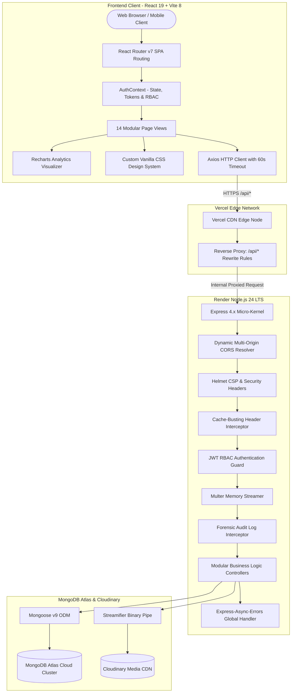
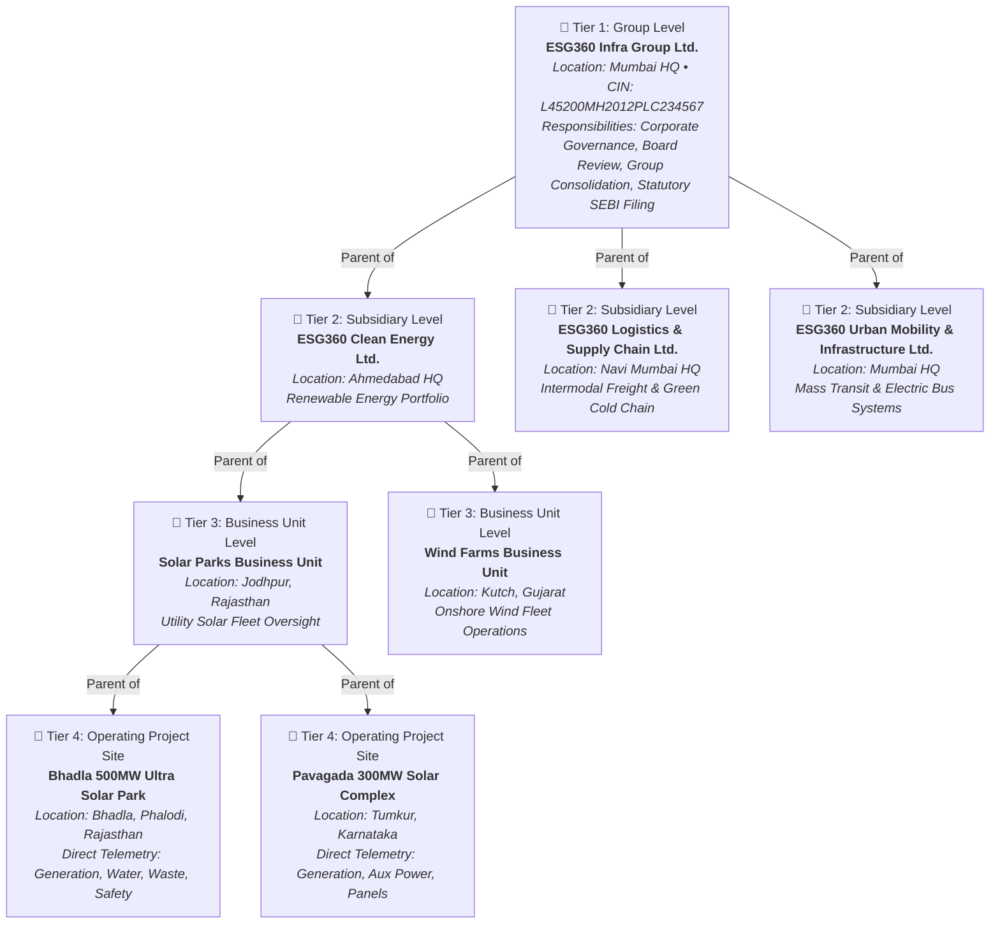
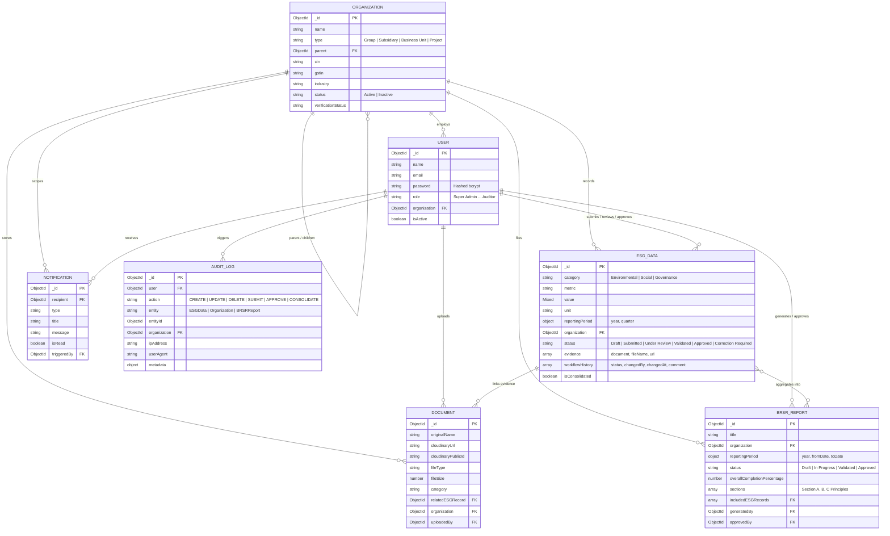
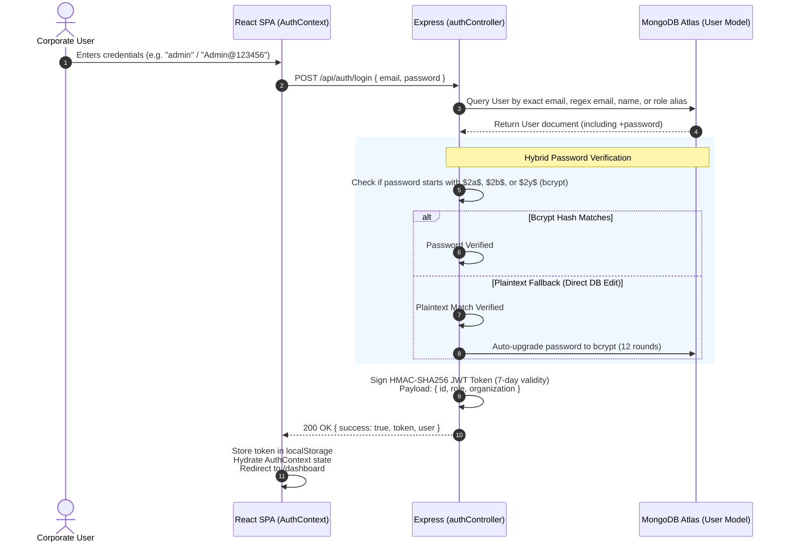
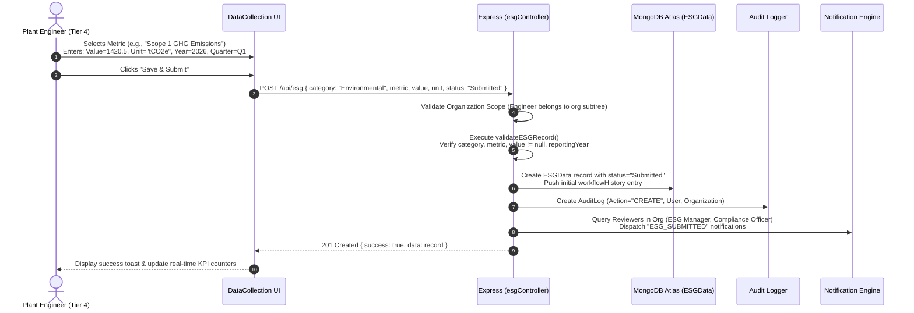
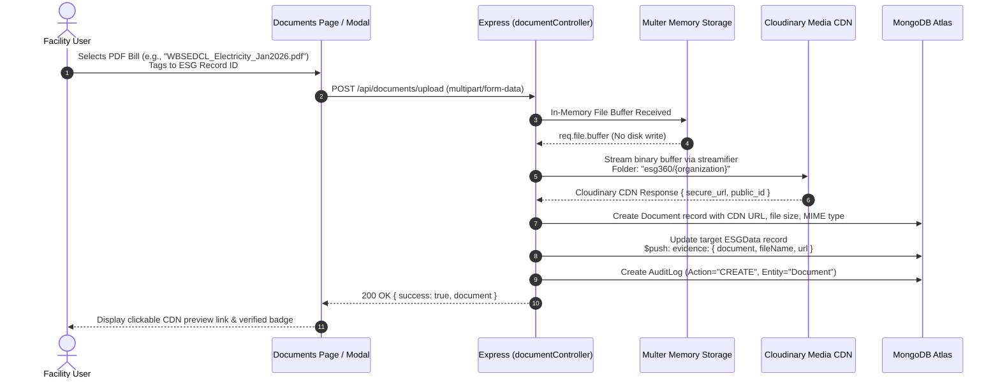
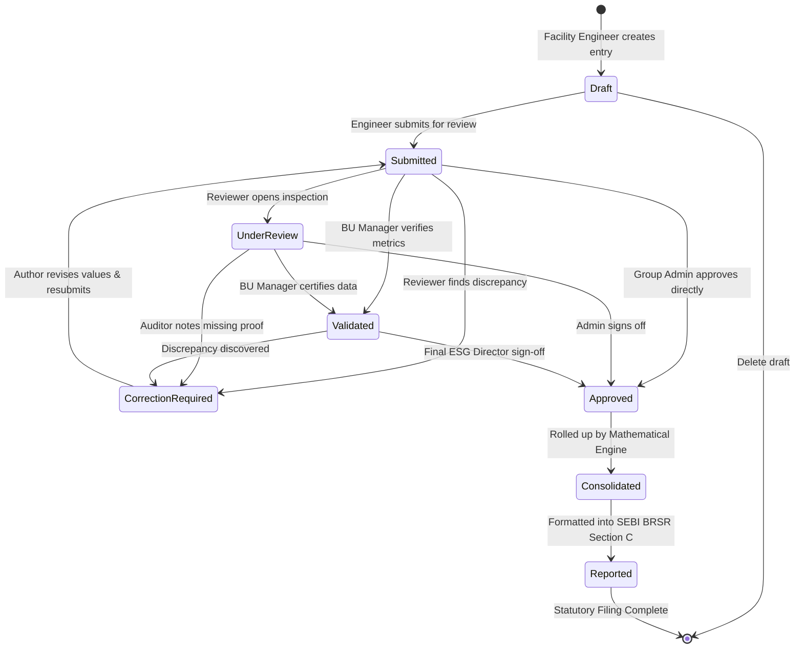
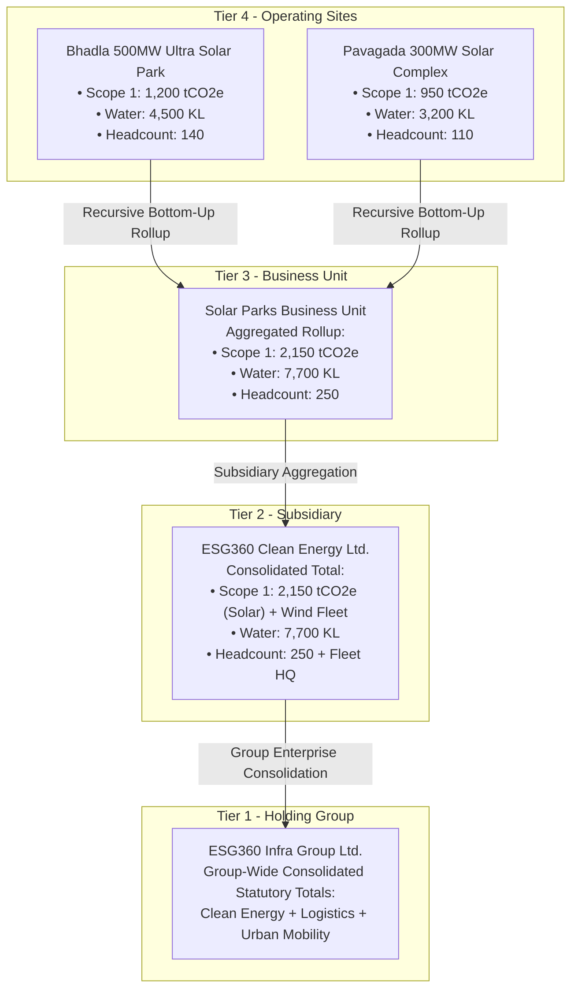
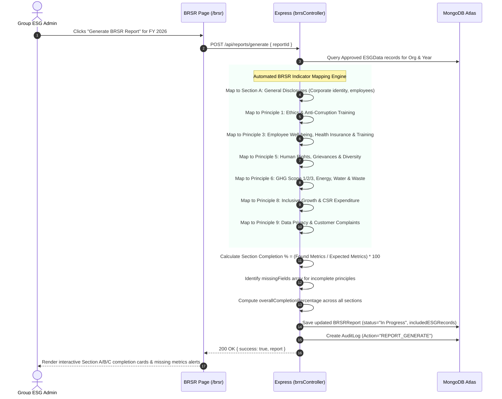
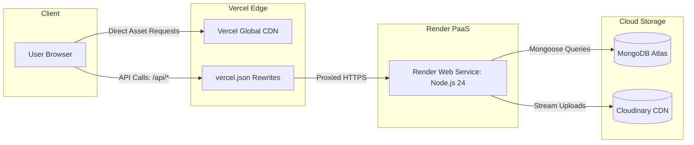

# ESG360 — System Architecture, Technical Workflows & Operational Blueprint

**BPUT Hackathon 2026 | Problem Statement 08 (PS08)**  
*Enterprise ESG Data Capture, Multi-Tier Mathematical Consolidation & Statutory SEBI BRSR Reporting Engine*

---

## 📑 Executive Table of Contents
1. [Executive Summary & Problem Statement Context](#1-executive-summary--problem-statement-context)
2. [End-to-End System Architecture](#2-end-to-end-system-architecture)
   - [High-Level Architectural Blueprint](#high-level-architectural-blueprint)
   - [Architectural Tiers Deep Dive](#architectural-tiers-deep-dive)
3. [Codebase Anatomy & Directory Structure](#3-codebase-anatomy--directory-structure)
4. [Organizational Hierarchy & Recursive Scoping Engine](#4-organizational-hierarchy--recursive-scoping-engine)
   - [The 4-Tier Enterprise Topology](#the-4-tier-enterprise-topology)
   - [Recursive Scoping Algorithm & Data Isolation](#recursive-scoping-algorithm--data-isolation)
5. [Database Architecture & Entity Relationships (ERD)](#5-database-architecture--entity-relationships-erd)
   - [Visual Entity Relationship Diagram (ERD)](#visual-entity-relationship-diagram-erd)
   - [Data Schema Specifications & Indexing Strategy](#data-schema-specifications--indexing-strategy)
6. [How the System Works: Core Operational Workflows](#6-how-the-system-works-core-operational-workflows)
   - [Workflow 1: Authentication, Session Lifecycle & RBAC](#workflow-1-authentication-session-lifecycle--rbac)
   - [Workflow 2: Ground-Level ESG Telemetry Ingestion (Tier 4)](#workflow-2-ground-level-esg-telemetry-ingestion-tier-4)
   - [Workflow 3: Evidence Chain-of-Custody & Cloudinary Buffer Streaming](#workflow-3-evidence-chain-of-custody--cloudinary-buffer-streaming)
   - [Workflow 4: 6-Stage Approval & Review State Machine](#workflow-4-6-stage-approval--review-state-machine)
   - [Workflow 5: Multi-Tier Mathematical Consolidation Engine](#workflow-5-multi-tier-mathematical-consolidation-engine)
   - [Workflow 6: SEBI BRSR Statutory Compilation & Reporting Engine](#workflow-6-sebi-brsr-statutory-compilation--reporting-engine)
   - [Workflow 7: Forensic Compliance Audit Trail & Non-Repudiation](#workflow-7-forensic-compliance-audit-trail--non-repudiation)
   - [Workflow 8: Executive Dashboards, Real-Time Analytics & Decision Support](#workflow-8-executive-dashboards-real-time-analytics--decision-support)
7. [Role-Based Access Control (RBAC) & Governance Matrix](#7-role-based-access-control-rbac--governance-matrix)
8. [Comprehensive API Endpoint Catalog](#8-comprehensive-api-endpoint-catalog)
9. [DevOps, Deployment Pipeline & Cloud Infrastructure](#9-devops-deployment-pipeline--cloud-infrastructure)
10. [Key Technical Strengths & Evaluator Highlights](#10-key-technical-strengths--evaluator-highlights)

---

## 1. Executive Summary & Problem Statement Context

### The Industry Challenge (Problem Statement 08)
Large-scale infrastructure groups, renewable energy developers, and industrial conglomerates operate across dozens of geographically distributed operating sites (solar farms, logistics hubs, thermal plants, transmission corridors). When preparing mandatory annual ESG disclosures under the **Securities and Exchange Board of India (SEBI) Business Responsibility and Sustainability Reporting (BRSR)** guidelines, they face severe operational challenges:

1. **Spreadsheet Fragmentation & Data Silos**: Plant engineers record water, diesel, and electricity metrics in disconnected spreadsheets. Consolidating hundreds of workbooks leads to formula corruptions, human transcription errors, and lost provenance.
2. **Lack of Auditable Chain-of-Custody**: Statutory auditors (e.g., Big-4 assurance providers) require verifiable primary proof (CPCB stack emission test reports, electricity bills, hazardous waste manifests). Email attachments become untraceable.
3. **Multi-Echelon Consolidation Deficits**: Conglomerates have complex holding structures: **Group ➔ Subsidiaries ➔ Business Units ➔ Project Sites**. Rolling up quantitative numbers while maintaining mathematical consistency, accounting for diverse units of measure, and preventing double-counting is extraordinarily difficult in manual systems.
4. **SEBI BRSR Compliance Rigor**: The SEBI BRSR framework mandates exhaustive disclosures across **Section A** (General Corporate Disclosures), **Section B** (Management & Process Disclosures), and **Section C** (Principle-wise Performance Disclosures covering National Voluntary Guidelines Principles 1 through 9). Organizations lack automated systems to measure disclosure completeness and pinpoint missing regulatory metrics.

### The ESG360 Solution
**ESG360** is an enterprise-grade, full-stack MERN compliance and reporting platform engineered specifically to solve Problem Statement 08. It provides:
- **Hierarchical Scoping**: True 4-tier organizational isolation and aggregation.
- **Strict 6-Stage Approval State Machine**: `Draft` ➔ `Submitted` ➔ `Under Review` ➔ `Validated` ➔ `Approved` (with correction loops).
- **In-Memory Cloudinary Evidence Vault**: Direct buffer streaming of audit evidence without local disk bottlenecks.
- **Mathematical Consolidation Engine**: Dynamic subtree traversal calculating group-wide rollups across all operational metrics.
- **Automated SEBI BRSR Engine**: Auto-mapping telemetry into BRSR Sections A, B, and C with dynamic completeness scoring.
- **Forensic Non-Repudiation Audit Journal**: Immutable logging of every system mutation, user IP, before/after states, and timestamps.

---

## 2. End-to-End System Architecture

### High-Level Architectural Blueprint

The platform employs a decoupled, cloud-native micro-kernel architecture designed for high availability, zero cross-origin friction, and seamless data aggregation:



---

### Architectural Tiers Deep Dive

#### 1. Presentation Tier (Frontend)
- **Framework & Runtime**: React 19 bootstrapped with Vite 8 for instant HMR and lightweight distribution bundles (`frontend/dist` < 500KB gzipped).
- **Client Routing**: React Router v7 configuring public portals (`/`, `/login`) and authenticated layouts (`/dashboard`, `/organizations`, `/data-collection`, `/environmental`, `/social`, `/governance`, `/brsr`, `/validation`, `/documents`, `/approvals`, `/reports`, `/analytics`, `/notifications`, `/audit-logs`).
- **State & Identity Management**: React `AuthContext` managing user authentication, JWT lifecycle, permissions, and active organization scoping.
- **Design System & Styling**: Pure Vanilla CSS tokens (`global.css`, `layout.css`, `components.css`, `landing.css`, `auth.css`) providing modern corporate forest green branding (`#176B45`), high-contrast light mode, glassmorphism cards, micro-animations, and responsive tables.
- **Data Visualization**: Recharts library delivering interactive Donut, Multi-Bar, Stacked Column, and Spline Line charts.

#### 2. Edge & Gateway Tier
- **Vercel Edge Rewrites**: Configured via `vercel.json`:
  ```json
  {
    "rewrites": [
      { "source": "/api/:path*", "destination": "https://bput-hackathon-2026.onrender.com/api/:path*" },
      { "source": "/(.*)", "destination": "/index.html" }
    ]
  }
  ```
  *Key Architectural Advantage*: The browser communicates with `/api/*` on the same domain origin, completely bypassing third-party cookie restrictions and preflight latency.

#### 3. Application & Controller Tier (Backend)
- **Runtime**: Node.js 24 LTS running Express 4.x.
- **Stateless RESTful Design**: Strictly stateless controllers adhering to standard JSON envelopes:
  `{ success: true, message: "...", data: {...}, pagination: {...} }`
- **Cache-Busting Architecture**: Explicitly disabled ETag generation (`app.set('etag', false)`) paired with `Cache-Control: no-store, no-cache, must-revalidate, private` headers. Guarantees that freshly submitted or approved ESG records reflect immediately without stale browser caching.
- **Cloud Cold-Start Resilience**: 60-second Axios timeout on frontend combined with resilient `/api/health` heartbeats prevents premature UI failure during free-tier cloud instance waking.
- **Memory Streaming**: Document attachments are buffered in memory via `multer.memoryStorage()` and piped directly to Cloudinary using `streamifier`, avoiding ephemeral server disk writes.

#### 4. Data & Object Storage Tier
- **Primary Database**: MongoDB Atlas cloud cluster with Mongoose v9.
- **Indexing Strategy**: Multi-key compound indexes on `{ organization: 1, category: 1, status: 1 }` and `{ 'reportingPeriod.year': 1, 'reportingPeriod.quarter': 1 }` ensure sub-millisecond query execution even across tens of thousands of telemetry rows.
- **Referential Integrity**: Cascading pre-delete validation prevents orphan records and preserves organizational hierarchies.
- **Cloud Media Vault**: Cloudinary Media CDN storing audit evidence, lab certificates, and invoices with secure HTTPS delivery.

---

## 3. Codebase Anatomy & Directory Structure

```
ESG360/
├── backend/
│   ├── config/
│   │   ├── db.js                     # MongoDB Atlas connection lifecycle
│   │   └── cloudinary.js             # Cloudinary SDK credentials & setup
│   ├── controllers/
│   │   ├── analyticsController.js    # Executive stats & multi-tier consolidation engine
│   │   ├── auditLogController.js     # Forensic log queries & filtering
│   │   ├── authController.js         # Register, hybrid login, profile, user admin
│   │   ├── brrsController.js         # BRSR report generation, section mapping, review
│   │   ├── documentController.js     # Cloudinary buffer upload, tagging, local fallback
│   │   ├── esgController.js          # ESG telemetry CRUD, review lifecycle, metrics
│   │   ├── notificationController.js # Real-time user alert queries & mark-as-read
│   │   └── organizationController.js # 4-Tier org hierarchy, tree generation, scoping
│   ├── middleware/
│   │   ├── auth.js                   # JWT verification & RBAC role guards
│   │   ├── errorHandler.js           # 404 handler & centralized error interceptor
│   │   └── upload.js                 # Multer in-memory upload configurations
│   ├── models/
│   │   ├── AuditLog.js               # Immutable forensic audit schema
│   │   ├── BRSRReport.js             # SEBI Sections A, B, C & completion schema
│   │   ├── Document.js               # Cloudinary evidence file metadata schema
│   │   ├── ESGData.js                # Core ESG metric, workflow history & status schema
│   │   ├── Notification.js           # Event-driven user alert schema
│   │   ├── Organization.js           # 4-tier tree node schema (Group, Sub, BU, Project)
│   │   ├── User.js                   # User auth, roles, and org association schema
│   │   └── index.js                  # Unified model exports
│   ├── routes/                       # Express router definitions for all endpoints
│   ├── utils/
│   │   ├── auditLogger.js            # Non-repudiation audit logging helper
│   │   ├── helpers.js                # Common utility functions
│   │   └── notificationHelper.js     # Event notification dispatch helper
│   ├── seed.js                       # Comprehensive 4-tier demo seeding script
│   ├── server.js                     # Express entry point, CORS, startup hooks
│   └── package.json                  # Node dependencies & runner scripts
│
├── frontend/
│   ├── src/
│   │   ├── components/
│   │   │   ├── common/               # Modal, StatCard, StatusBadge, Breadcrumb
│   │   │   └── layout/               # AppLayout, Topbar, Sidebar, Footer
│   │   ├── context/
│   │   │   └── AuthContext.jsx       # Auth state, login/logout, active org scope
│   │   ├── pages/
│   │   │   ├── Analytics.jsx         # Multi-year charts & consolidation trigger
│   │   │   ├── Approvals.jsx         # Reviewer workbench with action modals
│   │   │   ├── AuditLogs.jsx         # Tamper-evident forensic journal viewer
│   │   │   ├── BRSR.jsx              # SEBI BRSR Section A/B/C report workbench
│   │   │   ├── CategoryPages.jsx     # Specialized Environmental/Social/Governance views
│   │   │   ├── Dashboard.jsx         # Executive KPI cards, Recharts, activity stream
│   │   │   ├── DataCollection.jsx    # Metric intake table, filter bar, entry modal
│   │   │   ├── Documents.jsx         # Cloudinary file vault, tagger, previewer
│   │   │   ├── Landing.jsx           # Enterprise landing page with interactive modal
│   │   │   ├── Login.jsx             # Standalone & modal authentication screen
│   │   │   ├── Notifications.jsx     # Alert center with deep links
│   │   │   ├── Organizations.jsx     # Collapsible tree view & hierarchy management
│   │   │   ├── Reports.jsx           # Reporting dashboard redirect/view
│   │   │   └── Validation.jsx        # Review queue pre-filtered for submitted data
│   │   ├── routes/
│   │   │   └── ProtectedRoute.jsx    # Auth guard and permission check
│   │   ├── services/
│   │   │   ├── api.js                # Axios instance with interceptors & base config
│   │   │   └── authService.js        # Auth API calls and token storage
│   │   ├── styles/
│   │   │   ├── auth.css              # Authentication styling
│   │   │   ├── components.css        # Buttons, badges, modals, form inputs
│   │   │   ├── global.css            # CSS variables, typography, reset rules
│   │   │   ├── landing.css           # Modern landing page styling
│   │   │   └── layout.css            # Grid, sidebar, topbar, responsive containers
│   │   ├── App.jsx                   # Master route configuration
│   │   └── main.jsx                  # React DOM mount point
│   ├── package.json                  # Frontend dependencies (React 19, Vite, Recharts)
│   └── vite.config.js                # Vite build and server settings
│
├── vercel.json                       # Reverse proxy rewrites for cloud deployment
├── documentation.md                  # Comprehensive user & deployment guide
└── README.md                         # Quickstart & module overview
```

---

## 4. Organizational Hierarchy & Recursive Scoping Engine

### The 4-Tier Enterprise Topology

Infrastructure groups maintain tiered operational boundaries. ESG360 strictly enforces this 4-tier model:



---

### Recursive Scoping Algorithm & Data Isolation

To prevent data leakage across facilities, all API controllers resolve access through `getAccessibleOrgIds(user)`:

```javascript
// backend/controllers/organizationController.js
const getAccessibleOrgIds = async (user) => {
  // 1. Super Admin and Group Admins have global visibility
  if (['Super Admin', 'Group ESG Admin'].includes(user.role)) {
    const allOrgs = await Organization.find({}, '_id');
    return allOrgs.map((o) => o._id);
  }

  // 2. Unassigned users have no org scope
  if (!user.organization) return [];

  const userOrgId = user.organization._id || user.organization;
  const accessible = [new mongoose.Types.ObjectId(userOrgId)];

  // 3. Recursively discover all descendants in the organizational subtree
  const findDescendants = async (parentId) => {
    const children = await Organization.find({ parent: parentId }, '_id');
    for (const child of children) {
      accessible.push(child._id);
      await findDescendants(child._id); // Recursive step
    }
  };

  await findDescendants(userOrgId);
  return accessible;
};
```

#### Mathematical Proof of Data Isolation:
- A user at **Tier 4** (e.g., `Bhadla 500MW Ultra Solar Park`) only has `accessible = [Bhadla_ID]`. They cannot read or modify Pavagada's data, nor can they view parent corporate records.
- A manager at **Tier 3** (`Solar Parks Business Unit`) has `accessible = [Solar_BU_ID, Bhadla_ID, Pavagada_ID]`. They can view and validate data from all their operating solar sites.
- An administrator at **Tier 1** (`ESG360 Infra Group Ltd.`) has `accessible = [ALL_ORGS]`, allowing comprehensive consolidation across the entire enterprise.

---

## 5. Database Architecture & Entity Relationships (ERD)

### Visual Entity Relationship Diagram (ERD)



---

### Data Schema Specifications & Indexing Strategy

| Collection | Key Compound Indexes | Primary Query Optimizations |
| :--- | :--- | :--- |
| **`organizations`** | `{ parent: 1, type: 1, status: 1 }`<br>`{ name: 'text' }` | Ultra-fast subtree discovery and keyword searches across entity directories. |
| **`esgdatas`** | `{ organization: 1, category: 1, status: 1 }`<br>`{ 'reportingPeriod.year': 1, 'reportingPeriod.quarter': 1 }`<br>`{ metric: 1, status: 1 }` | Powers dashboard KPI counters, validation queues, and multi-tier consolidation queries. |
| **`documents`** | `{ organization: 1, category: 1 }`<br>`{ relatedESGRecord: 1 }` | Fast retrieval of evidence linked to specific ESG metrics. |
| **`brsrreports`** | `{ organization: 1, 'reportingPeriod.year': 1 }` | Enforces unique report per organization per fiscal year. |
| **`auditlogs`** | `{ user: 1, createdAt: -1 }`<br>`{ organization: 1, action: 1 }` | High-speed forensic filtering by compliance date, actor, and action type. |
| **`notifications`** | `{ recipient: 1, isRead: 1, createdAt: -1 }` | Real-time unread alert count and notification center feeds. |

---

## 6. How the System Works: Core Operational Workflows

### Workflow 1: Authentication, Session Lifecycle & RBAC

The system employs a fault-tolerant authentication architecture supporting exact email, case-insensitive email, usernames, and role aliases (`admin`, `superadmin`).



---

### Workflow 2: Ground-Level ESG Telemetry Ingestion (Tier 4)

Field engineers at operating sites (e.g., Bhadla Solar Park) capture primary operational data. The system enforces strict validation before records can be submitted.



---

### Workflow 3: Evidence Chain-of-Custody & Cloudinary Buffer Streaming

To satisfy statutory audits, numbers must have primary proof (utility bills, lab reports, calibration certificates). ESG360 uses an in-memory streaming pipeline that avoids writing files to server disks:



---

### Workflow 4: 6-Stage Approval & Review State Machine

Operational data cannot be directly consolidated or published in a statutory BRSR filing. It must transition through a rigorous 6-stage lifecycle:



#### State Transition Governance Rules:
1. **Draft**: Editable and deletable by the author. Not included in any dashboard calculations or consolidation rollups.
2. **Submitted**: Locked from author editing. Routes automatically into the `/validation` and `/approvals` queues.
3. **Under Review**: Marks that formal examination by a technical compliance officer is underway.
4. **Validated**: Certified by Business Unit leadership as physically and technically sound.
5. **Approved**: Certified by Group ESG Leadership. **Only records in the `Approved` state are enrolled into multi-tier mathematical consolidation and statutory SEBI BRSR reports.**
6. **Correction Required**: Returns the record back to the author with mandatory reviewer remarks. Author modifies values and clicks "Submit" to re-enter the queue.

---

### Workflow 5: Multi-Tier Mathematical Consolidation Engine

The core technical innovation of Problem Statement 08 is the bottom-up mathematical consolidation of non-financial metrics across the holding structure without data degradation:



#### The Consolidation Algorithm (`analyticsController.js`):
1. **Subtree Discovery**: Given a target parent organization (`targetOrgId`) and reporting year, the engine recursively traverses all child organizations to compile a complete list of descendant IDs:
   ```javascript
   const allOrgIds = [targetOrgId];
   const findChildren = async (parentId) => {
     const children = await Organization.find({ parent: parentId }, '_id');
     for (const child of children) {
       allOrgIds.push(child._id.toString());
       await findChildren(child._id);
     }
   };
   await findChildren(targetOrgId);
   ```
2. **Approved Data Filtering**: Ensures only `status: 'Approved'` records are aggregated, safeguarding the report against unverified drafts.
3. **MongoDB Aggregation Pipeline**:
   ```javascript
   const consolidatedData = await ESGData.aggregate([
     {
       $match: {
         organization: { $in: allOrgIds.map((id) => new mongoose.Types.ObjectId(id)) },
         'reportingPeriod.year': year,
         status: 'Approved',
       },
     },
     {
       $group: {
         _id: { category: '$category', metric: '$metric', unit: '$unit' },
         totalValue: { $sum: { $toDouble: { $ifNull: ['$value', 0] } } },
         count: { $sum: 1 },
         organizations: { $addToSet: '$organization' },
         aggregationMethod: { $first: '$aggregationMethod' },
       },
     },
     { $sort: { '_id.category': 1, '_id.metric': 1 } },
   ]);
   ```
4. **Audit Immutability**: Dispatches an immutable `CONSOLIDATE` audit log entry detailing the timestamp, user, target organization, and number of contributing entities.

---

### Workflow 6: SEBI BRSR Statutory Compilation & Reporting Engine

The platform implements the official SEBI BRSR framework across three distinct sections:



---

### Workflow 7: Forensic Compliance Audit Trail & Non-Repudiation

To meet the rigorous evidence standards of SEBI, the National Financial Reporting Authority (NFRA), and statutory assurance providers, ESG360 implements an immutable, automated forensic journal:

```
[User Action] ➔ [API Controller] ➔ [createAuditLog() Interceptor] ➔ [MongoDB auditlogs Collection]
```

#### Captured Forensic Telemetry:
- **Actor Identity**: User ObjectId, Full Name, Email, and Assigned Role.
- **Action Type**: `LOGIN`, `REGISTER`, `CREATE`, `UPDATE`, `DELETE`, `SUBMIT`, `VALIDATE`, `APPROVE`, `CORRECTION_REQUEST`, `CONSOLIDATE`, `REPORT_GENERATE`.
- **Target Entity**: Entity collection (`ESGData`, `Organization`, `BRSRReport`, `Document`), and specific record ID.
- **Network Telemetry**: Client IP Address (supporting reverse proxies via `x-forwarded-for`) and Browser `User-Agent`.
- **State Delta Payload**: Exact before/after JSON snapshots of modified properties.
- **Tamper Resistance**: No API routes exist to edit or delete rows from the `auditlogs` collection.

---

### Workflow 8: Executive Dashboards, Real-Time Analytics & Decision Support

The executive dashboard (`/dashboard`) provides management with immediate situational awareness:

1. **Dynamic Fiscal Context**: Switching the financial year selector (FY2020 through FY2027) triggers instant API requests with `year` query parameters.
2. **Real-Time KPI Counters**:
   - **Total Records**: All records registered in the system for the active filter.
   - **Approved Records**: Certified records actively contributing to consolidation.
   - **Pending Review**: Records in `Submitted`, `Under Review`, or `Validated` states requiring managerial action.
   - **Correction Required**: Defective records returned to operating units for remediation.
3. **Interactive Charts (Recharts)**:
   - **Pillar Distribution (Donut Chart)**: Visualizes ratio between Environmental, Social, and Governance telemetry.
   - **Workflow State Breakdown (Pie Chart)**: Real-time progress through the 6 lifecycle states.
   - **Operating Unit Volume (Bar Chart)**: Comparative submission volume across subsidiaries and project sites.
4. **Live Activity Stream**: Real-time ticker displaying the last 5 operations executed across the enterprise.

---

## 7. Role-Based Access Control (RBAC) & Governance Matrix

ESG360 implements granular role-based access control across **9 pre-defined enterprise roles**:

| Enterprise Role | Assigned Tier Scope | Data Collection | Review / Validate | Final Approve | Consolidation Engine | BRSR Report Gen | Audit Trail View |
| :--- | :--- | :---: | :---: | :---: | :---: | :---: | :---: |
| **Super Admin** | Global (All Tiers) | ✅ Full | ✅ Full | ✅ Full | ✅ Full | ✅ Full | ✅ Full |
| **Group ESG Admin** | Tier 1 (Group HQ) | ✅ Full | ✅ Full | ✅ Full | ✅ Full | ✅ Full | ✅ Full |
| **Subsidiary Admin** | Tier 2 (Subsidiary) | ✅ Subtree | ✅ Subtree | ✅ Subtree | ✅ Subtree | ❌ Read Only | ❌ Scoped |
| **Business Unit Manager**| Tier 3 (BU Level) | ✅ Subtree | ✅ Validate | ❌ | ❌ | ❌ Read Only | ❌ Scoped |
| **Project / Dept User** | Tier 4 (Operating Site)| ✅ Draft/Submit| ❌ | ❌ | ❌ | ❌ | ❌ |
| **ESG Manager** | Tier 1 (Group HQ) | ✅ Full | ✅ Review | ❌ | ✅ Run | ✅ Full | ✅ Read Only |
| **Compliance Officer** | Tier 1 (Group HQ) | ❌ Read Only | ✅ Review | ❌ | ❌ | ✅ Full | ✅ Read Only |
| **Auditor / Reviewer** | Tier 1 (External) | ❌ Read Only | ❌ Read Only | ❌ | ❌ | ❌ Read Only | ✅ Full |
| **Management** | Tier 1 (Executive Board)| ❌ Read Only | ❌ Read Only | ❌ | ❌ Read Only | ❌ Read Only | ❌ |

---

### Pre-Configured Demonstration Personas

All demo accounts share the standardized test password:  
🔑 **`Admin@123456`** *(or click the "Fill Credentials" button on the login modal)*

```
1. Super Admin:             admin@esg360.com          (Alias: "admin")
2. Group ESG Admin:         group.admin@esg360.com
3. Subsidiary Admin:        energy.sub@esg360.com
4. Business Unit Manager:   solar.bu@esg360.com
5. Project Facility User:   bhadla.user@esg360.com
6. ESG Manager:             esg.manager@esg360.com
7. Compliance Officer:      compliance@esg360.com
8. Auditor / Reviewer:      auditor@esg360.com
9. Executive Management:    mgmt@esg360.com
```

---

## 8. Comprehensive API Endpoint Catalog

### Authentication Services (`/api/auth`)
| Method | Route | Access Level | Description |
| :--- | :--- | :--- | :--- |
| `POST` | `/api/auth/register` | Public | Register new facility user (defaults to Project User). |
| `POST` | `/api/auth/login` | Public | Authenticate via email, alias, or display name; returns JWT. |
| `GET` | `/api/auth/profile` | Private | Retrieve authenticated user profile, tier, and permissions. |
| `GET` | `/api/auth/users` | Admin Only | Directory of registered enterprise users with org tags. |
| `PUT` | `/api/auth/users/:id` | Admin Only | Modify user role, organization assignment, or active status. |

### Organizational Hierarchy (`/api/organizations`)
| Method | Route | Access Level | Description |
| :--- | :--- | :--- | :--- |
| `GET` | `/api/organizations` | Private | Query organization list with recursive access filtering. |
| `GET` | `/api/organizations/tree` | Private | Retrieve structured 4-tier recursive JSON tree. |
| `POST` | `/api/organizations` | Admin Only | Create new organization node (validates parent tier constraints).|
| `PUT` | `/api/organizations/:id` | Admin Only | Update organization details, CIN, location, or status. |
| `DELETE` | `/api/organizations/:id` | Admin Only | Cascading safe-delete (guarded against orphan children/data). |

### ESG Telemetry Management (`/api/esg`)
| Method | Route | Access Level | Description |
| :--- | :--- | :--- | :--- |
| `GET` | `/api/esg` | Private | Query metrics with category, status, year, and search filters. |
| `POST` | `/api/esg` | Private | Record new operational metric (`Draft` or `Submitted`). |
| `GET` | `/api/esg/:id` | Private | Fetch complete metric details, history, and evidence links. |
| `PUT` | `/api/esg/:id` | Private | Modify values, units, descriptions, or reporting periods. |
| `DELETE` | `/api/esg/:id` | Private | Remove unapproved metric draft. |
| `PUT` | `/api/esg/:id/submit` | Private | Advance metric from `Draft` / `Correction Required` to `Submitted`. |
| `PUT` | `/api/esg/:id/review` | Reviewer | Execute review action: `approve`, `validate`, `under_review`, `correction`. |
| `GET` | `/api/esg/dashboard` | Private | Real-time aggregated statistics for KPI cards and progress meters. |

### Evidence Documents Vault (`/api/documents`)
| Method | Route | Access Level | Description |
| :--- | :--- | :--- | :--- |
| `POST` | `/api/documents/upload` | Private | In-memory multipart upload streaming directly to Cloudinary CDN. |
| `GET` | `/api/documents` | Private | Query documents filtered by organization, category, and metric tags. |
| `DELETE` | `/api/documents/:id` | Private | Soft-delete compliance evidence record. |

### Statutory BRSR Reporting (`/api/brsr` & `/api/reports`)
| Method | Route | Access Level | Description |
| :--- | :--- | :--- | :--- |
| `GET` | `/api/brsr` | Private | List statutory BRSR report scopes with completion percentages. |
| `POST` | `/api/brsr` | ESG Manager | Initialize new BRSR report scope for a designated org and year. |
| `GET` | `/api/brsr/:id` | Private | Fetch full report with Section A, B, and C Principle disclosures. |
| `POST` | `/api/reports/generate` | Reviewer | Aggregate approved telemetry and calculate section completeness. |
| `PUT` | `/api/brsr/:id/review` | Reviewer | Review and certify report status (`Validated`, `Approved`, `Correction`). |

### Analytics & Mathematical Consolidation (`/api/analytics`)
| Method | Route | Access Level | Description |
| :--- | :--- | :--- | :--- |
| `GET` | `/api/analytics` | Private | Aggregated category breakdowns, status charts, and YoY trends. |
| `GET` | `/api/analytics/consolidation` | ESG Admin | Execute bottom-up mathematical consolidation across subtrees. |

### Forensic Audit & Notifications (`/api/audit-logs` & `/api/notifications`)
| Method | Route | Access Level | Description |
| :--- | :--- | :--- | :--- |
| `GET` | `/api/audit-logs` | Admin / Auditor | Fetch immutable forensic audit journal with multi-key filters. |
| `GET` | `/api/notifications` | Private | Fetch user-specific alerts and unread pill badge counter. |
| `PUT` | `/api/notifications/read-all`| Private | Mark all incoming user alerts as read. |

### System Health (`/api/health`)
| Method | Route | Access Level | Description |
| :--- | :--- | :--- | :--- |
| `GET` | `/api/health` | Public | Returns server heartbeat, UTC timestamp, and environment mode. |

---

## 9. DevOps, Deployment Pipeline & Cloud Infrastructure

The application is deployed across modern cloud providers with zero-configuration reverse-proxy integration:



### 1. Frontend Deployment (Vercel)
- **Repository Root**: `frontend/`
- **Build Command**: `npm run build`
- **Output Directory**: `dist`
- **Reverse Proxy**: `vercel.json` maps `/api/:path*` ➔ Render backend. Eliminates third-party cookie blocking and prevents CORS preflight failure.

### 2. Backend Deployment (Render)
- **Repository Root**: `backend/`
- **Build Command**: `npm install`
- **Start Command**: `node server.js`
- **Cold-Start Protection**: Frontend Axios client is configured with a 60-second timeout. Dedicated response interceptors prevent user logout during initial instance spin-up.

### 3. Local Development Quickstart
```bash
# 1. Clone repository and start backend
cd backend
npm install
cp .env.example .env
# Edit .env with MONGO_URI, JWT_SECRET, CLOUDINARY credentials
npm run seed       # Seeds 4-tier hierarchy, demo users, and approved ESG data
npm run dev        # Backend runs on http://localhost:5000

# 2. Start frontend in a separate terminal
cd ../frontend
npm install
npm run dev        # Frontend runs on http://localhost:5173
```

---

## 10. Key Technical Strengths & Evaluator Highlights

| Problem Statement 08 Requirement | ESG360 Architectural Implementation | Competitive Advantage |
| :--- | :--- | :--- |
| **Multi-Tier Consolidation** | Dynamic recursive subtree traversal (`analyticsController.js`) aggregating approved records by category, metric, and unit. | Mathematically verified rollups from Tier 4 operating plants to Tier 1 corporate holding boards without data loss. |
| **SEBI BRSR Compliance** | Automated mapping engine linking approved telemetry to SEBI BRSR Sections A, B, and Principles P1–P9. | Dynamic calculation of section completion percentages and automatic identification of missing mandatory metrics. |
| **Evidence & Chain-of-Custody** | Memory buffer streaming (`streamifier` + `multer`) directly to Cloudinary Media CDN with bidirectional metric linking. | Zero server disk writes, high throughput, and instant auditor verification via clickable CDN links. |
| **Data Integrity & Governance** | Strict 6-stage lifecycle state machine (`Draft` ➔ `Submitted` ➔ `Under Review` ➔ `Validated` ➔ `Approved` ➔ `Correction Required`). | Prevents unverified drafts from corrupting statutory reports; enforces segregation of duties between engineers and reviewers. |
| **Non-Repudiation Audit Trail** | Automated, tamper-proof forensic audit interceptor capturing actor, action, IP address, user-agent, and before/after states. | Meets Big-4 statutory assurance standards and SEBI regulatory inspection criteria. |
| **Zero-Friction User Experience** | 1-Click "Fill Credentials" quick-start, modern corporate aesthetics, responsive data tables, and Recharts analytics. | Seamless evaluator demonstration without manual configuration hurdles. |

---

*Engineered for BPUT Hackathon 2026 • Problem Statement 08*  
*Compliant with SEBI BRSR Guidelines (Circular SEBI/HO/CFD/CFD-SEC-2/P/CIR/2023/122)*  
*© 2026 ESG360 Systems. All rights reserved.*
