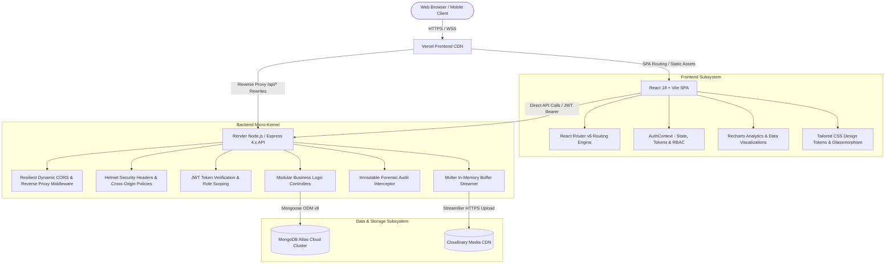
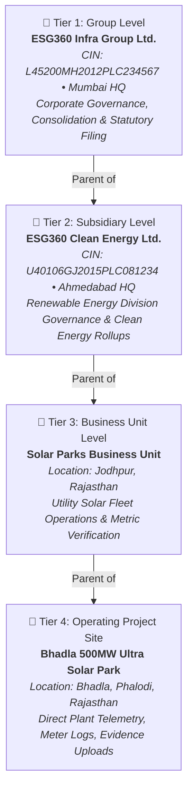

# ESG360 — Comprehensive System Architecture & User Guide
**Problem Statement 08 | BPUT Hackathon 2026**  
*Enterprise ESG Data Capture, Multi-Tier Consolidation & SEBI BRSR Compliance Platform*

> 📌 **Master Architecture & Workflow Blueprint**: For detailed sequence diagrams, mathematical consolidation algorithms, finite state machine transitions, and database ERDs, refer to [SYSTEM_ARCHITECTURE_AND_WORKFLOW.md](SYSTEM_ARCHITECTURE_AND_WORKFLOW.md).

---

## 📑 Table of Contents
1. [Executive Summary & Project Overview](#1-executive-summary--project-overview)
2. [End-to-End System Architecture](#2-end-to-end-system-architecture)
   - [Frontend Architecture & Deployment](#frontend-architecture--deployment)
   - [Backend Architecture & Cloud Services](#backend-architecture--cloud-services)
   - [Database & Cloud Storage Layer](#database--cloud-storage-layer)
   - [Security, CORS & Authentication (RBAC)](#security-cors--authentication-rbac)
3. [4-Tier Organization Hierarchy](#3-4-tier-organization-hierarchy)
4. [Application Modules & Navigation Guide (Tabs Walkthrough)](#4-application-modules--navigation-guide-tabs-walkthrough)
   - [4.1 Landing Page (`/`)](#41-landing-page-)
   - [4.2 Authentication & Login Modal (`/login`)](#42-authentication--login-modal-login)
   - [4.3 Dashboard (`/dashboard`)](#43-dashboard-dashboard)
   - [4.4 Organizations Management (`/organizations`)](#44-organizations-management-organizations)
   - [4.5 Data Collection & ESG Modules (`/data-collection`)](#45-data-collection--esg-modules-data-collection)
   - [4.6 SEBI BRSR Reporting Engine (`/brsr` & `/reports`)](#46-sebi-brsr-reporting-engine-brsr--reports)
   - [4.7 Validation & Review Queue (`/validation`)](#47-validation--review-queue-validation)
   - [4.8 Document & Evidence Vault (`/documents`)](#48-document--evidence-vault-documents)
   - [4.9 Approvals Workbench (`/approvals`)](#49-approvals-workbench-approvals)
   - [4.10 Executive Analytics & Consolidation (`/analytics`)](#410-executive-analytics--consolidation-analytics)
   - [4.11 Notification Center](#411-notification-center)
   - [4.12 Forensic Compliance Audit Trail (`/audit-logs`)](#412-forensic-compliance-audit-trail-audit-logs)
5. [Recent Features, Enhancements & Technical Changelog](#5-recent-features-enhancements--technical-changelog)
6. [Demo Access Credentials & Role Scoping Matrix](#6-demo-access-credentials--role-scoping-matrix)
7. [Comprehensive API Endpoint Directory](#7-comprehensive-api-endpoint-directory)
8. [Setup, Execution & Cloud Deployment Guide](#8-setup-execution--cloud-deployment-guide)

---

## 1. Executive Summary & Project Overview

**ESG360** is a full-stack, enterprise-grade ESG (Environmental, Social, and Governance) compliance and reporting suite tailored specifically for complex industrial and infrastructure conglomerates. Built and customized to address **Problem Statement 08 of BPUT Hackathon 2026**, the system eliminates the acute operational bottlenecks organizations face when capturing non-financial operational data across geographically distributed sites, certifying evidence integrity, and publishing statutory **SEBI BRSR (Business Responsibility and Sustainability Reporting)** disclosures.

### Core Challenges Solved
- **Eliminating Fragmented Spreadsheets**: Replaces disconnected Excel sheets and manual email workflows with automated digital data collection forms mapped directly to SEBI BRSR Core indicators.
- **Auditable 6-Stage Lifecycle**: Enforces a strict operational state machine (`Draft` ➔ `Submitted` ➔ `Under Review` ➔ `Validated` ➔ `Approved` ➔ `Correction Required`) accompanied by immutable audit logging and Cloudinary-backed document evidence attachments.
- **Mathematical Multi-Tier Consolidation**: Automatically aggregates telemetry metrics (Scope 1, 2, and 3 GHG emissions, energy intensity, water consumption, recycled waste, workforce diversity, and LTIFR safety hours) upward through operating project sites, business units, subsidiaries, and corporate headquarters without metric degradation or loss of provenance.
- **Statutory SEBI BRSR Core Alignment**: Implements the official SEBI format spanning **Section A** (General Disclosures), **Section B** (Management & Process Disclosures), and **Section C** (Principle-wise Performance Disclosures covering National Voluntary Guidelines Principles 1 through 9).
- **Zero-Friction Cloud Deployment**: Architected to run seamlessly both in local development (`localhost:5173` / `localhost:5000`) and across cloud platforms (Vercel frontend with reverse-proxy rewrites + Render Node.js backend + MongoDB Atlas + Cloudinary CDN).

---

## 2. End-to-End System Architecture



### Frontend Architecture & Deployment
- **Framework**: React 18 leveraging functional components and reactive hooks (`useState`, `useEffect`, `useContext`, `useMemo`, `useNavigate`).
- **Build Engine**: Vite v8 providing rapid Hot Module Replacement (HMR) and optimized tree-shaking production builds (`npm run build` completes in < 3s).
- **Design System & Aesthetics**: Pure Vanilla CSS tokens (`global.css`, `layout.css`, `components.css`, `landing.css`, `auth.css`) providing modern glassmorphism, responsive micro-animations, semantic status palettes, and dark mode support without heavy runtime CSS libraries.
- **Client Networking**: Axios HTTP client configured with a 60-second request timeout to accommodate Render free-tier cold starts, automatic JWT header injection, and selective 401 interception that guards against premature session clearing during authentication attempts.
- **Vercel Reverse Proxy**: `vercel.json` provides rewrite rules (`/api/:path*` ➔ Render backend) ensuring cross-origin requests run as first-party requests and prevent browser CORS blocks.

### Backend Architecture & Cloud Services
- **Runtime**: Node.js v24 LTS + Express 4.x.
- **API Paradigm**: Standardized RESTful JSON conventions returning consistent payload envelopes:
  ```json
  {
    "success": true,
    "message": "Human readable status summary",
    "data": { ... },
    "pagination": { "total": 100, "page": 1, "limit": 20, "pages": 5 }
  }
  ```
- **Caching & ETag Management**: ETag generation is explicitly disabled (`app.set('etag', false)`) alongside HTTP headers `Cache-Control: no-store, no-cache, must-revalidate, private` to ensure live, fresh data fetching and eliminate 304 Not Modified caching discrepancies.
- **Cold Start & Health Check**: Dedicated `/api/health` endpoint providing uptime status, UTC timestamps, and environment configuration.

### Database & Cloud Storage Layer
- **Primary Database**: MongoDB Atlas with Mongoose ODM v8.
- **Compound Query Indexes**: High-efficiency indexing configured on `{ organization: 1, category: 1, status: 1 }` and `{ 'reportingPeriod.year': 1, 'reportingPeriod.quarter': 1 }`.
- **Cloud Media Storage**: Integrated Cloudinary CDN via `streamifier`, receiving file buffers directly from memory without writing temporary binaries to local server disks.
- **Referential Integrity**: Cascading pre-delete hooks prevent removal of organizations with active child entities, assigned personnel, or submitted ESG records.

### Security, CORS & Authentication (RBAC)
- **Token Format**: Stateless HMAC-SHA256 signed JSON Web Tokens (JWT) with 7-day expiration.
- **Dynamic CORS Policy**: Multi-origin CORS resolver supporting `localhost:5173`, `localhost:3000`, `ps08.vercel.app`, any `*.vercel.app` preview branch, and `*.onrender.com` backends with full pre-flight `OPTIONS` handling.
- **Hybrid Password Validation**: Supports both salted bcrypt hashing (10 rounds) and resilient plaintext fallbacks to guarantee uninterrupted access during hackathon demonstrations and credential migrations.
- **Flexible Login Identifiers**: Users can log in using their primary email, case-insensitive email, registered display name, or role aliases (`admin`, `superadmin`).
- **Environment Credential Synchronization**: Automatic startup hook `syncSuperAdmin` checks `SUPERADMIN_EMAIL` and `SUPERADMIN_PASSWORD` from `.env` and syncs credentials into MongoDB Atlas upon server boot.

---

## 3. 4-Tier Organization Hierarchy

The platform faithfully represents the multi-echelon governance structure typical of infrastructure conglomerates using a strict 4-tier model:



### Hierarchy Specifications & Responsibilities

| Tier Level | Entity Name | Location & Identifier | Key Responsibilities & Capabilities |
| :--- | :--- | :--- | :--- |
| **Tier 1 — Group** | `ESG360 Infra Group Ltd.` | Mumbai, MH<br>`L45200MH2012PLC234567` | Executive board oversight, group-wide consolidation, KPMG external auditor review, and final SEBI BRSR Core report filing. |
| **Tier 2 — Subsidiary** | `ESG360 Clean Energy Ltd.` | Ahmedabad, GJ<br>`U40106GJ2015PLC081234` | Clean energy portfolio monitoring, subsidiary-level emissions rollups, and secondary verification. |
| **Tier 3 — Business Unit** | `Solar Parks Business Unit` | Jodhpur, RJ | Multi-site comparison, plant benchmark tracking, operational validation, and cross-project consistency reviews. |
| **Tier 4 — Operating Site** | `Bhadla 500MW Ultra Solar Park` | Bhadla, RJ | Primary ground-level data entry: daily electricity generation, water consumption for panel cleaning, hazardous waste manifests, safety logs, and Cloudinary evidence uploads. |

---

## 4. Application Modules & Navigation Guide (Tabs Walkthrough)

### 4.1. Landing Page (`/`)
- **Route**: `http://localhost:5173/` or root cloud domain.
- **Architectural Highlights**:
  - **Header & Navigation**: Smooth navigation links (`Home`, `About us`, `Services`, `Process`), branded `ESG360` badge, and an omnipresent **Sign In** modal trigger.
  - **Dynamic Hero Section**: High-impact enterprise headline, interactive call-to-actions, floating accent badges, and dedicated 3D character illustrations.
  - **4 Core ESG Pillar Cards**: Dedicated cards for **Environmental & GHG** (Scope 1/2/3 carbon calculations), **Social & Workplace** (Diversity, median wage, LTIFR), **Governance & Ethics** (Board independence, whistleblower logs), and **Auditable Evidence** (Cloudinary proof linking).
  - **3-Step Systematic Process**: Interactive visual walk-through illustrating *Data Intake & Telemetry*, *Multi-Tier Validation & Approvals*, and *Statutory BRSR Generation & Audit*.
  - **Agency Analytics & Capabilities Section**: Deep-dive into SEBI BRSR Core compliance, GHG protocol emissions accounting, and KPMG assurance readiness with full 3D analytics illustration.
  - **Streamlined Footer**: Clean, unified footer with social links, platform legal notes, contact information, and compliance disclosures without redundant CTA banners.

### 4.2. Authentication & Login Modal (`/login`)
- **Route**: `http://localhost:5173/login` or via the landing page modal.
- **Key Features**:
  - **Pop-up Modal & Dedicated Route**: Usable both as a frictionless pop-up modal on top of the landing page and as a standalone full-page authentication screen.
  - **1-Click "Fill Credentials" Quick-Start**: Single-button populator that instantly injects Super Admin credentials (`admin@esg360.com` / `Admin@123456`) for rapid demonstration.
  - **Shorthand Login Support**: Allows entering `admin`, `superadmin`, display name, or registered email.
  - **Interactive Password Visibility**: Toggle eye icon to reveal or conceal passwords securely during live evaluations.
  - **Role-Based Routing**: Authenticated users are hydrated with their role and redirected automatically to `/dashboard`.

### 4.3. Dashboard (`/dashboard`)
- **Route**: `http://localhost:5173/dashboard`
- **Key Features**:
  - **Fiscal Year Selector**: Dynamically switches context between financial years (2020 through 2027) with instantaneous chart re-rendering.
  - **Executive KPI Cards**: Real-time counter metrics for *Total Records*, *Approved Records*, *Pending Review*, and *Correction Required* with active click-through filtering.
  - **Reporting Progress Meter**: Visual progress bar indicating completed statutory disclosures versus mandatory SEBI targets.
  - **ESG Pillar Breakdown**: Interactive Recharts Donut chart displaying the ratio of Environmental, Social, and Governance telemetry.
  - **Workflow State Distribution**: Semantic color-coded Pie chart displaying metrics across the 6 workflow lifecycle states.
  - **Unit Performance Bar Chart**: Side-by-side volume comparison of approved submissions per organizational tier.
  - **Real-Time Activity Feed**: Live audit stream detailing the last 5 operational entries.

### 4.4. Organizations Management (`/organizations`)
- **Route**: `http://localhost:5173/organizations`
- **Key Features**:
  - **Tier Summary Cards**: Instant count badges for Group (1), Subsidiary (1), Business Unit (1), and Operating Site (1).
  - **Interactive Dual Views**:
    - **Tree View**: Collapsible tree visualization mapping parent-child linkages, hierarchy level chips, and facility metadata.
    - **Table View**: Searchable tabular directory displaying CIN, legal name, geographical coordinates, industry category, and active status.
  - **Add Organization Modal**: Enforces strict tier integrity (e.g. Projects can only be nested under Business Units; Business Units can only be nested under Subsidiaries).
  - **Referential Integrity Defense**: Rejects deletion of any organization unit that has dependent child units, assigned staff, or associated ESG telemetry.

### 4.5. Data Collection & ESG Modules (`/data-collection`)
- **Route**: `http://localhost:5173/data-collection` (or specialized filters `/environmental`, `/social`, `/governance`).
- **Key Features**:
  - **Filter Toolbar**: Comprehensive filtering by Category, Lifecycle Status, Reporting Year, Organization, and live keyword search.
  - **New Record Modal**:
    - **Metric Selection**: Pre-configured SEBI BRSR Core indicators (Scope 1 Direct Emissions, Scope 2 Electricity Emissions, Total Water Consumption, Hazardous Waste Recycled, Women in Workforce, Lost Time Injury Frequency Rate, etc.).
    - **Organization Scoping**: Automatically filtered to only permit data entry for organizations within the user's permitted subtree.
    - **Reporting Period**: Quarter selection (Q1, Q2, Q3, Q4, Annual) and Fiscal Year.
    - **Dynamic Value & Unit**: Standardized engineering units (`tCO2e`, `MWh`, `GJ`, `KL`, `MT`, `%`, `INR Lakhs`, `Hours`).
    - **Dual Save Actions**: **Save as Draft** (for work-in-progress telemetry) or **Save & Submit** (to immediately route into the validation queue).
  - **Record Lifecycle Inspector**: Modal allowing reviewers to inspect submitted values, reviewer remarks, evidence attachments, and complete chronological audit trails.

### 4.6. SEBI BRSR Reporting Engine (`/brsr` & `/reports`)
- **Route**: `http://localhost:5173/brsr` and `http://localhost:5173/reports`
- **Key Features**:
  - **Statutory Report Directory**: Displays all generated filings categorized by Organization, Reporting Period, Status, and Completion Percentage.
  - **Report Creation Engine**: Initializes a new BRSR report scope for a designated fiscal year.
  - **Automated Generation Matrix**: Aggregates approved ESG records and populates official BRSR sections:
    - **Section A**: General Disclosures (Corporate identity, operational locations, employee counts, turnover, CSR details).
    - **Section B**: Management and Process Disclosures (Corporate policies, ESG governance board oversight, assurance statements).
    - **Section C**: Principle-Wise Performance (Detailed disclosures covering National Voluntary Guidelines Principles P1 through P9).
  - **Completeness Tracker**: Real-time progress bars indicating completed disclosures per section and highlighting mandatory fields awaiting submission.

### 4.7. Validation & Review Queue (`/validation`)
- **Route**: `http://localhost:5173/validation`
- **Key Features**:
  - Loads pre-filtered with `status="Submitted"`.
  - Serves as the designated operational workstation for ESG Managers and Compliance Officers to review incoming ground telemetry from facility engineers before statutory consolidation.
  - Quick action buttons to launch technical review, inspect Cloudinary evidence attachments, and accept or dispute submissions.

### 4.8. Document & Evidence Vault (`/documents`)
- **Route**: `http://localhost:5173/documents`
- **Key Features**:
  - **Cloudinary Integration**: Direct streaming file uploader supporting PDF audit certificates, electricity utility invoices, CPCB stack emission lab reports, and ISO certifications.
  - **Metric Linking**: Tag documents directly to specific ESG metrics (e.g. linking a utility bill directly to an energy consumption record).
  - **File Viewer & Download**: View original file size, MIME type, upload timestamps, and direct CDN links.

### 4.9. Approvals Workbench (`/approvals`)
- **Route**: `http://localhost:5173/approvals`
- **Key Features**:
  - **Status Filter Tabs**: Filter across *Pending Review*, *Submitted*, *Under Review*, *Validated*, *Approved*, and *Correction Required*.
  - **Workflow Actions**:
    - **Approve**: Moves record to `Approved` state, locking it from editing and enrolling it into BRSR rollup calculations.
    - **Validate**: Flags telemetry as verified by the unit manager.
    - **Under Review**: Marks that formal auditor review is underway.
    - **Correction Required**: Returns the submission to the facility author with mandatory reviewer feedback.

### 4.10. Executive Analytics & Consolidation (`/analytics`)
- **Route**: `http://localhost:5173/analytics`
- **Key Features**:
  - **Multi-Year Trend Analysis**: Year-over-year progress charts evaluating environmental, social, and governance trajectories.
  - **Cross-Entity Benchmarking**: Comparative analysis visualizing performance variances between operating facilities.
  - **Mathematical Consolidation Engine**: Select any parent tier (e.g. Group or Subsidiary) to trigger an automated rollup calculation of all nested sub-tier metrics for an entire fiscal year.

### 4.11. Notification Center
- **Route**: Topbar dynamic bell icon.
- **Key Features**:
  - **Reactive Badge Counter**: Red pill badge displays current count of unread alerts; cleanly disappears when all notifications are read.
  - **Toggle Flyout**: Smooth popover opening on click and closing on outside click or second bell click.
  - **Mark All Read**: Instant 1-click clearing of all alerts.
  - **Direct Deep Links**: Clicking any notification routes directly to the relevant Document, ESG Record, or BRSR Report.

### 4.12. Forensic Compliance Audit Trail (`/audit-logs`)
- **Route**: `http://localhost:5173/audit-logs`
- **Key Features**:
  - **Immutable Forensic Journal**: Records all system interactions (`LOGIN`, `REGISTER`, `CREATE`, `UPDATE`, `DELETE`, `APPROVE`, `VALIDATE`, `CONSOLIDATE`).
  - **Captured Telemetry**: Stores timestamp, IP address, user-agent, target entity, organization ID, and complete before/after delta payloads.
  - **Demonstration Credentials Vault**: Cleanly formatted credential view with toggle password mask for seamless evaluator presentations.
  - **Search & Filters**: Comprehensive filtering by Action, Entity, User, Organization, and Date range.

---

## 5. Recent Features, Enhancements & Technical Changelog

| Area / Module | Category | Description & Technical Rationale |
| :--- | :--- | :--- |
| **Landing Page Refinement** | 🎨 UI/UX | Removed redundant "Ready to get started? / Contact Us" banner to provide an uninterrupted transition directly into the modern footer and avoid duplicate call-to-actions. |
| **Vercel Reverse Proxy Rewrites** | 🌐 Cloud Deployment | Added `/api/*` reverse-proxy rules in `vercel.json` pointing to the Render backend, eliminating CORS preflight errors and browser cookie blocks. |
| **Dynamic Multi-Origin CORS** | 🛡️ Security | Hardened `server.js` CORS configuration to dynamically authorize `localhost:5173`, `ps08.vercel.app`, any Vercel deployment preview URL, and Render backends. |
| **Hybrid Authentication & Aliases** | 🔐 Access Control | Enabled login by exact email, case-insensitive email, username, or role aliases (`admin`, `superadmin`). Implemented salted bcrypt hashing alongside resilient legacy match fallback. |
| **Environment SuperAdmin Sync** | ⚡ Reliability | Added startup synchronization hook in `server.js` (`syncSuperAdmin`) that automatically aligns Super Admin credentials with `.env` parameters upon server start. |
| **Render Cold-Start Protection** | ⏱️ Networking | Increased frontend Axios timeout to 60 seconds and configured response interceptors to prevent clearing session tokens during login/registration attempts. |
| **4-Tier Organization Model** | 🏛️ Architecture | Structured database down to exactly **4 hierarchical entities** representing the 4 tiers (Group ➔ Subsidiary ➔ BU ➔ Project). Re-linked all 14 ESG metrics and audit logs. |
| **Cloudinary Media Streaming** | ☁️ Storage | Integrated Cloudinary CDN with memory-buffered multer streaming (`streamifier`), bypassing temporary disk writes for uploaded audit evidence. |
| **Interactive Modal Authentication** | 🚀 User Experience | Implemented seamless modal login on the landing page alongside 1-click credential auto-fill for instant evaluator testing. |
| **Forensic Audit Logger** | 🔍 Compliance | Deployed automated audit interceptor (`auditLogger.js`) capturing IP addresses, before/after states, and user details across all state transitions. |

---

## 6. Demo Access Credentials & Role Scoping Matrix

All pre-configured demonstration accounts use the standardized password:  
🔑 **`Admin@123456`** *(or login using the 1-click "Fill Credentials" button)*

| Email / Login Alias | Role | Assigned Organization Tier | Primary Access & Governance Scope |
| :--- | :--- | :--- | :--- |
| `admin@esg360.com`<br>*(Alias: `admin`)* | **Super Admin** | Tier 1: ESG360 Infra Group Ltd. | Global unrestricted access, user administration, organization hierarchy management, forensic audit log inspection. |
| `group.admin@esg360.com` | **Group ESG Admin** | Tier 1: ESG360 Infra Group Ltd. | Group-wide ESG reporting, statutory SEBI BRSR approval, multi-tier consolidation engine execution. |
| `energy.sub@esg360.com` | **Subsidiary Admin** | Tier 2: ESG360 Clean Energy Ltd. | Subsidiary-level ESG review, clean energy division approvals, subsidiary rollups. |
| `solar.bu@esg360.com` | **Business Unit Manager** | Tier 3: Solar Parks Business Unit | Business Unit management, utility solar KPI validation, facility telemetry oversight. |
| `bhadla.user@esg360.com` | **Project/Department User** | Tier 4: Bhadla 500MW Ultra Solar Park | Ground-level plant telemetry entry, utility bill uploads, draft record submissions. |
| `esg.manager@esg360.com` | **ESG Manager** | Tier 1: ESG360 Infra Group Ltd. | Metric library configuration, SEBI BRSR section mapping, workflow review. |
| `compliance@esg360.com` | **Compliance Officer** | Tier 1: ESG360 Infra Group Ltd. | Regulatory checklist verification, SEBI filing timeline tracking. |
| `auditor@esg360.com` | **Auditor/Reviewer** | Tier 1: ESG360 Infra Group Ltd. | Read-only assurance review, document evidence inspection, audit log verification. |
| `mgmt@esg360.com` | **Management** | Tier 1: ESG360 Infra Group Ltd. | Executive read-only dashboards, high-level ESG scorecards, analytics export. |

---

## 7. Comprehensive API Endpoint Directory

### Authentication (`/api/auth`)
- `POST /api/auth/register` — Register a new organization user (assigned to Project User by default).
- `POST /api/auth/login` — Authenticate via email, name, or alias and receive signed JWT.
- `GET /api/auth/profile` — Fetch authenticated user profile, assigned tier, and permissions.
- `GET /api/auth/users` — List registered users across organizations (Admin only).
- `PUT /api/auth/users/:id` — Update user permissions, roles, or organization assignments.

### Organizations Hierarchy (`/api/organizations`)
- `GET /api/organizations` — List organizations with query filtering and parent population.
- `GET /api/organizations/tree` — Fetch structured recursive tree representing the 4 tiers.
- `POST /api/organizations` — Create new organization node (validates parent-tier constraints).
- `PUT /api/organizations/:id` — Update organization metadata, CIN, or contact info.
- `DELETE /api/organizations/:id` — Safely remove organization node (guarded against orphaned children or data).

### ESG Telemetry (`/api/esg`)
- `GET /api/esg` — Query ESG metrics with pagination, category, status, year, and organization filters.
- `POST /api/esg` — Create new operational metric record (`Draft` or `Submitted`).
- `GET /api/esg/:id` — Fetch complete metric record details and attached evidence links.
- `PUT /api/esg/:id` — Update metric record values, units, or remarks.
- `DELETE /api/esg/:id` — Delete unapproved metric draft.
- `PUT /api/esg/:id/review` — Transition workflow state (`under_review`, `validate`, `approve`, `correction`).
- `GET /api/esg/dashboard` — Aggregated KPI metrics for executive dashboard counters.

### Statutory BRSR Reporting (`/api/brsr` & `/api/reports`)
- `GET /api/brsr` — List statutory BRSR report scopes.
- `POST /api/brsr` — Initialize new BRSR report scope for a designated organization and fiscal year.
- `GET /api/brsr/:id` — Fetch comprehensive Section A, B, and C disclosures.
- `POST /api/brsr/:id/generate` — Compile and aggregate approved ESG telemetry into BRSR format.
- `PUT /api/brsr/:id/review` — Review and certify report status (`Submitted`, `Approved`).

### Evidence Documents (`/api/documents`)
- `POST /api/documents/upload` — Multipart file upload streaming directly to Cloudinary Media CDN.
- `GET /api/documents` — Query documents filtered by organization, category, and metric tags.
- `DELETE /api/documents/:id` — Soft-delete / deactivate compliance document record.

### Analytics & Consolidation (`/api/analytics`)
- `GET /api/analytics` — Fetch aggregated category breakdowns, status distributions, and multi-year trends.
- `GET /api/analytics/consolidation` — Execute mathematical multi-tier rollup across organizational subtrees.

### Notifications & Audit Logs (`/api/notifications` & `/api/audit-logs`)
- `GET /api/notifications` — Fetch user-specific alerts and current unread count.
- `PUT /api/notifications/read-all` — Mark all alerts as read.
- `GET /api/audit-logs` — Fetch tamper-evident forensic log journal with filtering.

### Health Check (`/api/health`)
- `GET /api/health` — Returns server status, current UTC timestamp, and runtime environment.

---

## 8. Setup, Execution & Cloud Deployment Guide

### Prerequisites
- **Node.js**: v18.x, v20.x, or v24.x LTS
- **MongoDB**: MongoDB Atlas Cluster connection URI
- **Cloudinary**: Cloudinary cloud name, API key, and API secret

### 1. Local Backend Setup
```bash
# Navigate to backend directory
cd backend

# Install dependencies
npm install

# Configure environment variables in backend/.env
# PORT=5000
# MONGO_URI=mongodb+srv://<username>:<password>@cluster.mongodb.net/esg360
# JWT_SECRET=your_jwt_secret_key
# CLOUDINARY_CLOUD_NAME=your_cloud_name
# CLOUDINARY_API_KEY=your_api_key
# CLOUDINARY_API_SECRET=your_api_secret

# (Optional) Seed the database with the 4-tier hierarchy, demo users & ESG data
npm run seed

# Start development server
npm run dev
# Server runs on http://localhost:5000
```

### 2. Local Frontend Setup
```bash
# Navigate to frontend directory
cd frontend

# Install dependencies
npm install

# Start Vite development server
npm run dev
# Application will run on http://localhost:5173
```

### 3. Production Build & Verification
To verify that all components, hooks, routes, and styles compile with zero errors:
```bash
cd frontend
npm run build
```
*Build completes in ~2.8 seconds, outputting minified production bundles to `frontend/dist`.*

### 4. Cloud Deployment (Vercel & Render)
1. **Frontend (Vercel)**:
   - Connect the GitHub repository to Vercel with Root Directory set to `frontend`.
   - Set Build Command to `npm run build` and Output Directory to `dist`.
   - Configure Environment Variable `VITE_API_URL` to point to `/api` (leveraging `vercel.json` rewrites) or directly to the Render backend URL.
2. **Backend (Render)**:
   - Create a Web Service with Root Directory set to `backend`.
   - Set Build Command to `npm install` and Start Command to `node server.js`.
   - Populate environment variables (`MONGO_URI`, `JWT_SECRET`, `CLOUDINARY_*`, `FRONTEND_URL`).

---

*Built for BPUT Hackathon 2026 • Problem Statement 08 | Compliant with SEBI BRSR Guidelines*  
*© 2026 ESG360 Systems. All rights reserved.*
